# 上海生物制造产业发展情况

> 本稿基于2021—2025年生物制造相关发明授权专利识别结果形成，最新年份可能受到专利授权滞后和数据库更新进度影响，相关判断需结合后续完整数据持续校准。本稿主要用于检验数据口径、分析框架和图表体系，企业经营与产品信息仍需在正式稿中通过官网、政府文件和公告进一步核验。

## 第一节 全国生物制造技术路线及专利演进

### （一）主要技术路线

生物制造是利用生物体、细胞或生物分子的功能进行物质加工与合成的生产方式。国家《“十四五”生物经济发展规划》将其作为生物经济的重要发展方向，强调推动化工、医药、材料、轻工等产品制造与生物技术深度融合。本报告在专利识别的13类原始技术方向基础上，为便于咨询报告分析，归并形成七条技术路线。[S1][S2]

**1. 生物设计、读写与自动化工具。** 该路线包括DNA/RNA测序、合成和编辑，生物元件与线路设计，计算生物学和人工智能辅助设计，以及高通量测试筛选和实验自动化。其作用类似于生物制造的“研发工具链”：读取生命系统信息，设计遗传元件或代谢通路，构建候选菌株，再通过自动化平台测试和迭代。关键制约包括复杂生物系统预测能力不足、实验数据标准不统一，以及自动化研发结果与真实工业工艺之间仍需衔接。[S3][S4]

**2. 酶与蛋白质工程。** 酶和功能蛋白是生物制造的重要催化工具。通过结构设计、序列改造、定向进化和高通量筛选，可提高酶的催化效率、选择性、稳定性及工业环境耐受性。工业化不仅要求获得具有目标功能的酶，还要求解决表达量、使用寿命、原料适应性、固定化和规模化成本等问题。国家合成生物技术创新中心建设任务将工业酶列为重点突破方向，反映出其在生物制造底层能力中的重要性。[S3]

**3. 细胞工厂与菌株工程。** 该路线通过代谢工程、底盘细胞选择、基因改造和菌种选育，把微生物或其他细胞改造成特定产品的生产单元。核心目标是在产量、转化率、生产强度和遗传稳定性之间实现平衡。实验室高产菌株进入工业环境后，还要面对原料波动、代谢负担、污染和长期传代稳定性等问题。因此，核心菌种自主构建与工程化应用是连接合成生物研究和工业制造的重要环节。[S3][S5]

**4. 生物过程与规模化。** 该路线涵盖发酵工程、生物反应器、过程控制、中试放大和下游分离纯化，是把实验室菌株和酶转化为稳定生产工艺的关键。大型反应器中的传质、传热、混合和污染控制与小试条件差异明显，目标产物的分离纯化也可能占据较高成本。生物制造能否形成成本竞争力，不仅取决于前端生物学创新，也取决于设备能力、工艺稳定性、连续生产和质量控制。[S1][S2]

**5. 原料与低碳路线。** 该路线关注生物制造所使用的碳源和资源环境绩效，包括非粮生物质、木质纤维素、农业与食品废弃物、工业副产物以及二氧化碳等原料。其目标是降低对粮食糖源和石化原料的依赖。主要难点包括原料成分波动、预处理成本、抑制物影响、收集运输半径和全生命周期碳排放核算。因此，采用生物过程并不自动等于低碳，仍需结合原料、能源和工艺效率综合评估。[S1][S2]

**6. 生物制造产品与应用。** 该路线包括氨基酸、有机酸、核苷酸、酶制剂、重组蛋白、高值活性分子、生物基材料、食品营养产品和农业生物制品等。不同产品的经济性差异较大：大宗产品强调低成本和规模稳定，高值产品更重视纯度、质量一致性和监管要求。专利数量能够反映产品方向和技术布局，但不能单独证明产能、销售规模或市场成熟度。[S1][S5]

**7. 前沿制造与基础支撑。** 该路线归并3D生物打印等前沿制造方式、生物制造基础概念，以及质量、安全和标准等支撑内容。相关技术可能拓展生物制造的边界，但不同方向成熟度差异较大，通常需要更长验证周期和更严格的安全监管。该路线是本报告为提高统计可读性作出的归并，正式分析应结合具体原始技术方向，避免把前沿研究笼统描述为已经产业化。[S4][S5]

### （二）全国不同技术路线的专利变化

2021—2025年，国内生物制造相关发明授权专利分别为4904件、5708件、6579件、5703件和4914件，2023年达到样本期高点。2024—2025年数量低于2023年，但由于数据采用授权年份，且最新年份可能尚未完整，不宜据此直接判断技术创新活动转弱。

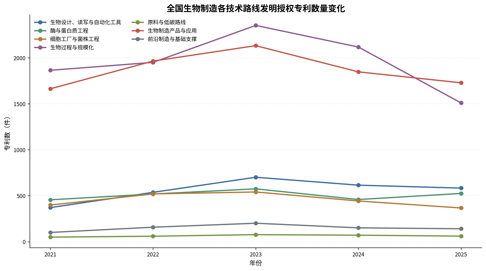

从总体结构看，生物过程与规模化、生物制造产品与应用分别占国内专利的35.2%和33.6%，两者合计接近七成，说明当前专利活动较多集中在制造工艺和产品形成环节。生物设计、读写与自动化工具占10.1%，其年度占比由2021年的7.6%提高到2025年的11.9%；酶与蛋白质工程占9.1%，细胞工厂与菌株工程占8.2%。原料与低碳路线占比仅为1.1%，一方面反映该方向识别口径较为聚焦，另一方面也表明相关专利规模目前相对有限。

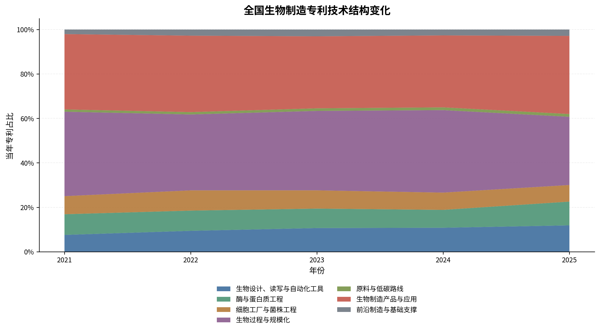

总体上，全国生物制造专利呈现“生产过程和产品应用占主体、设计工具占比上升、底层菌株和酶工程保持一定规模”的结构。由于专利分类基于文本识别，以上结果更适合用于观察技术布局，而不宜直接推断各技术路线的实际产值和产业成熟度。

## 第二节 上海生物制造创新发展的总体特征

### （一）创新规模与年度变化

2021—2025年，上海共识别出生物制造相关发明授权专利1576件，涉及487个创新主体，专利数量占国内样本的5.69%，在省级地区中排名第6位。年度专利数量由2021年的255件增加至2023年的394件，2024年和2025年分别为305件和271件；活跃创新主体由101个增至2024年的167个，2025年为132个。最新年份数量下降可能受到授权滞后和数据更新进度影响，正式判断应以完整数据复核。

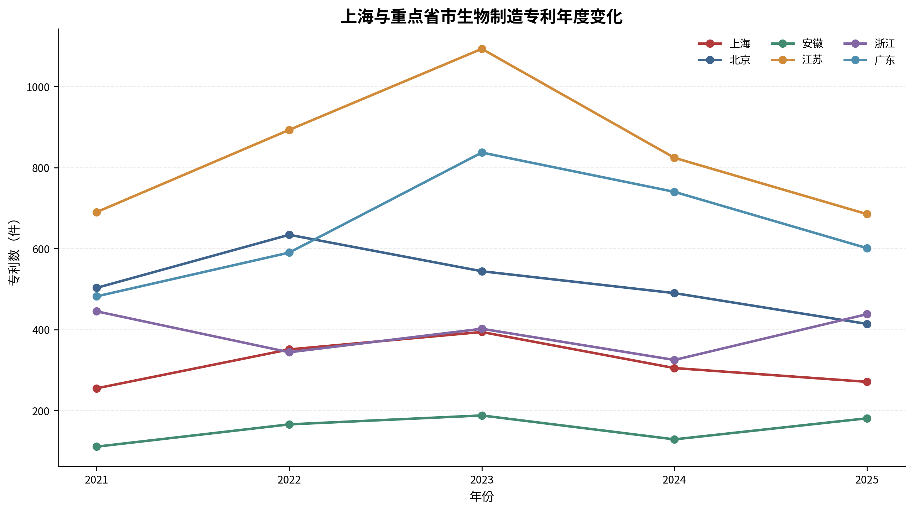

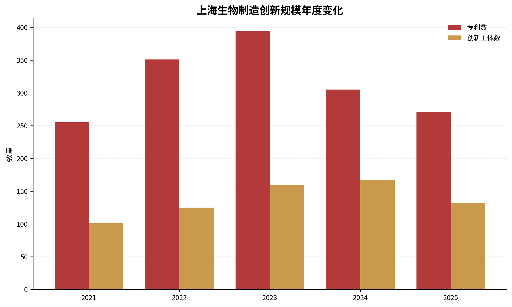

### （二）上海技术结构

上海专利主要集中在生物过程与规模化和生物制造产品与应用，两类分别为523件和509件，占比为33.2%和32.3%。生物设计、读写与自动化工具为192件，占12.2%；细胞工厂与菌株工程、酶与蛋白质工程分别占8.8%和8.6%。前沿制造与基础支撑占4.3%，原料与低碳路线占0.7%。

从年度变化看，设计、读写与自动化工具在上海的占比从2021年的7.1%升至2025年的13.3%，但年度数量在2023年达到56件后有所回落。生物过程与规模化始终是主要方向之一，产品与应用在2025年占比为36.5%。鉴于最新年份可能不完整，应更多关注结构而非短期增减。

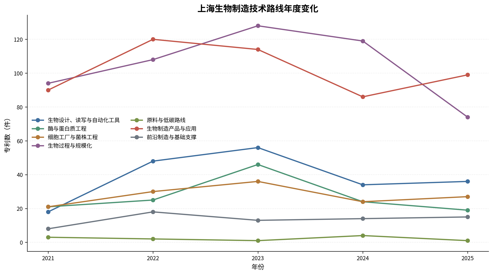

### （三）上海创新发展的主要特征

第一，上海形成了制造工艺与产品应用并重的专利结构，两类合计占65.5%，反映其专利布局既包含发酵、反应器和分离纯化等制造过程，也覆盖生物材料、活性分子、食品营养等产品方向。第二，设计工具、细胞工厂和酶工程合计占29.0%，说明上海具备一定前端生物设计和底层工程基础。第三，上海创新主体构成较为多元，企业专利709件，高校专利591件，科研院所专利185件，三类主体均形成一定规模。

这些特征只能说明上海的专利创新布局。是否形成规模化产能、市场竞争优势和成果转化效率，还需要经营、融资、产能和项目数据进一步验证。

### （四）与重点省市的比较

2021—2025年，江苏、广东、北京、浙江、上海和安徽的专利数量分别为4185件、3250件、2585件、1954件、1576件和775件。上海规模低于江苏、广东、北京和浙江，高于安徽。在年度排名上，上海在2022年位居第5，其他年份多为第6或第7。

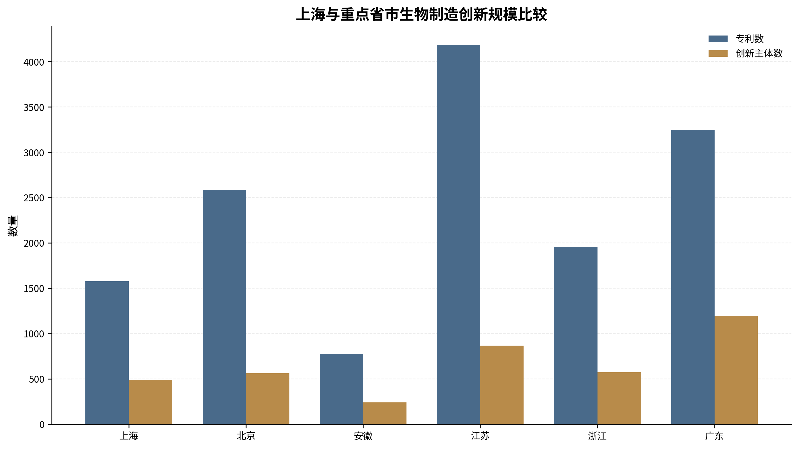

技术结构方面，上海生物设计、读写与自动化工具占12.2%，与北京的13.7%和广东的11.8%较为接近；酶与蛋白质工程占8.6%，低于江苏和浙江约14.8%和14.6%的水平。上海生物过程与规模化占33.2%，产品与应用占32.3%，整体结构介于北京相对重视设计和细胞工厂、广东相对偏向产品应用、江苏和浙江在酶工程方面占比较高的特征之间。该比较表明，上海具有相对综合的技术布局，但在专利总量和部分底层工程方向上仍存在差距。

## 第三节 上海生物制造企业主体与发展梯队

### （一）企业规模与年度变化

当前样本识别出上海生物制造相关企业398家，企业专利709件，占上海全部相关专利的45.0%。年度活跃企业由2021年的68家增加至2024年的127家，2025年为92家；企业年度专利由89件增加至2023年的180件，2024年为173件，2025年为131件。

样本期内企业首次出现数量较高，但2021年是观察期起点，不能把当年全部企业解释为真正的新进入者。2022年以后“新进入企业”也只是首次在当前专利样本中出现，并不等于企业实际成立或首次开展生物制造业务。

### （二）企业创新持续性

398家企业中，68家在两个及以上年份出现专利，占17.1%；16家在三个及以上年份出现。专利维度上的多年活跃企业占比相对有限，说明上海企业样本中既有持续布局主体，也存在较多仅在一个年份出现的企业。该结果可能反映企业专利布局具有项目性和阶段性，也可能受到五年观察窗口较短的影响，不能直接认定一次出现企业缺乏实际研发能力。

### （三）企业梯队与头部主体

从专利数量看，上海凯赛生物技术股份有限公司以75件居首，主要集中在生物过程与规模化，并覆盖产品应用、原料与低碳、酶工程和细胞工厂等方向。康码（上海）生物科技有限公司为17件，光明乳业股份有限公司为10件，丰益（上海）生物技术研发中心有限公司为9件。其他多数企业专利数量低于10件。

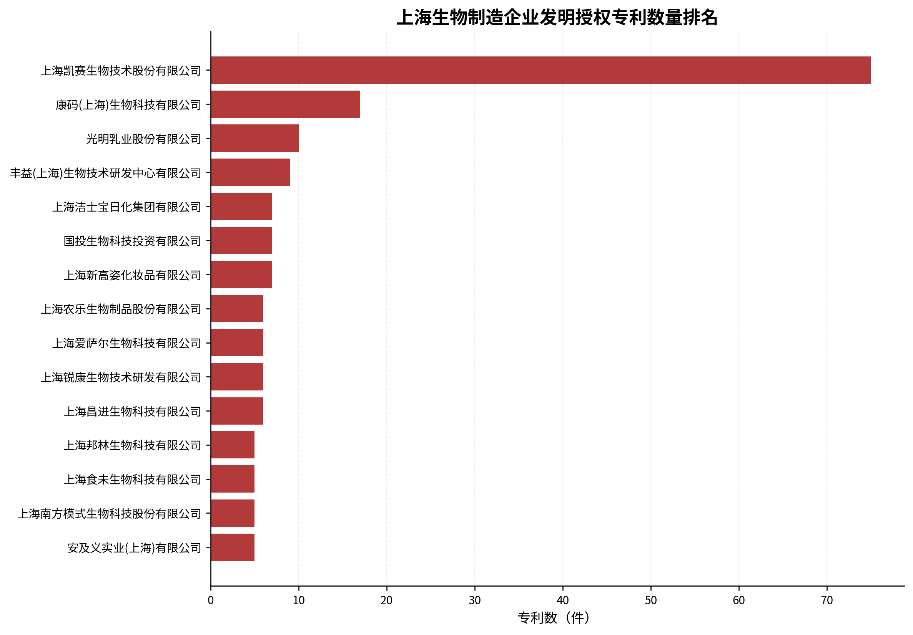

这一分布表现为头部第一家企业专利积累较突出，其余企业较为分散。因而企业梯队可初步划分为：具有较多持续专利积累的头部候选、在特定技术方向形成多件专利的专业化候选，以及样本期内新出现的储备主体。该划分仅为专利维度的分析，不等同于市场地位分级。

### （四）企业专利集中度

上海企业专利CR1为10.6%，CR3为14.4%，CR5为16.6%，CR10为21.2%，HHI为0.0148。整体集中度不高，说明除首位企业外，大量专利分散在较多企业中。与“高度集中于少数企业”相比，上海更接近“一家相对突出、其余主体较为分散”的结构。这种结构有利于形成多样化企业群体，但也意味着第二梯队企业的专利积累仍有提升空间。

### （五）与重点省市的比较

上海企业数量为398家，低于广东988家、江苏725家和浙江459家，与北京392家接近，高于安徽183家；企业专利709件，低于广东1758件、江苏1367件、北京802件和浙江782件。上海多年活跃企业占比17.1%，低于对比省市约19.5%—21.9%的水平。

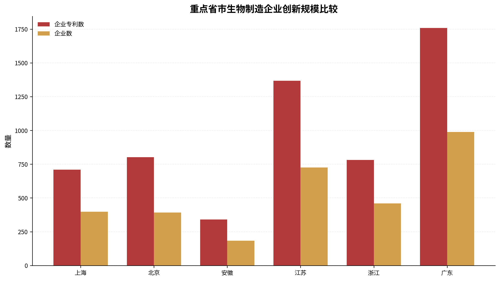

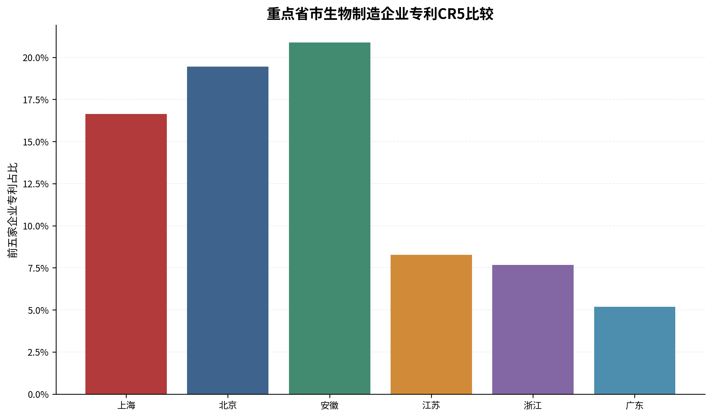

集中度方面，上海CR5高于广东、江苏和浙江，低于安徽和北京。结合企业数量看，广东、江苏拥有更大规模的企业群体且专利分布更分散；上海企业数量和专利总量处于中游，首位企业优势相对明显，但稳定的中坚企业数量仍需进一步观察。

## 第四节 上海生物制造企业技术布局

### （一）企业技术路线结构

上海企业专利主要分布在生物过程与规模化和生物制造产品与应用，分别为301件和252件，占企业专利的42.5%和35.5%。设计、读写与自动化工具占7.3%，酶与蛋白质工程占6.5%，细胞工厂与菌株工程占4.9%；前沿制造与基础支撑、原料与低碳路线占比较低。

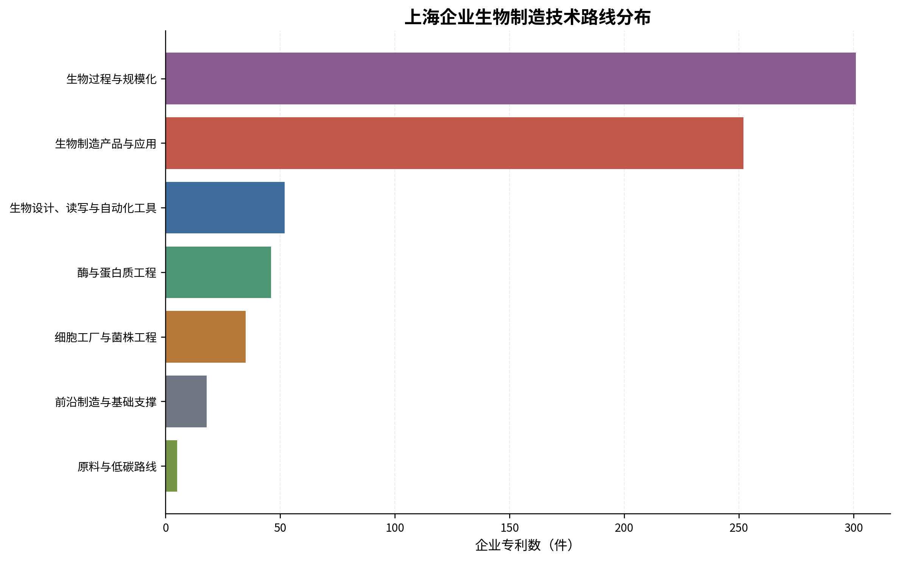

### （二）企业技术布局的主要特点

上海企业布局明显偏向生产制造和产品形成环节。生物过程与规模化涉及193家企业，产品与应用涉及160家企业，两类既具有较高专利数量，也具有较广主体覆盖。这与上海凯赛、光明乳业及多家食品、材料、日化和生物技术企业的专利布局相一致。

相比之下，设计工具、酶工程和细胞工厂等底层技术路线的企业专利合计占比不足两成。需要注意，这并不意味着上海缺乏相关研发能力；高校和科研院所在这些方向的专利占比更高，企业端与科研端呈现不同的技术结构。

### （三）企业技术布局的相对薄弱方向

从专利数量看，原料与低碳路线仅有5件企业专利，前沿制造与基础支撑为18件，细胞工厂与菌株工程为35件。上述方向可作为进一步核验的相对薄弱领域，但不能直接据此认定上海缺少相关产能或企业。正式报告还需结合企业名录、重大项目、中试平台和产业投资数据判断。

### （四）与重点省市的比较

上海企业在生物过程与规模化方向占42.5%，低于安徽和江苏、接近浙江，高于广东；产品与应用占35.5%，低于广东的42.9%，高于江苏的26.2%。上海企业设计工具占7.3%，低于江苏和北京；酶与蛋白质工程占6.5%，明显低于浙江和江苏。由此看，上海企业专利更集中于过程和产品两端，而江苏、浙江在酶与蛋白质工程方面呈现更高占比，北京在设计工具和细胞工厂方面相对更突出。

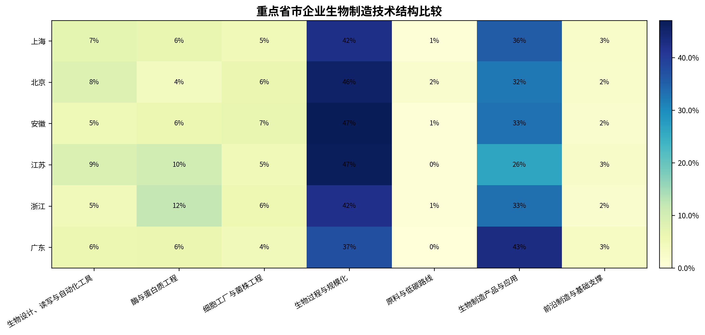

## 第五节 上海高校和科研院所的技术支撑

### （一）高校和科研院所创新规模

上海高校和科研院所合计拥有776件生物制造相关专利，其中高校591件、科研院所185件，分别涉及21所高校和25家科研院所。华东理工大学和上海交通大学分别为139件和133件，同济大学60件，上海市农业科学院和复旦大学各55件。中国科学院分子植物科学卓越创新中心、华东师范大学等也形成较多专利积累。

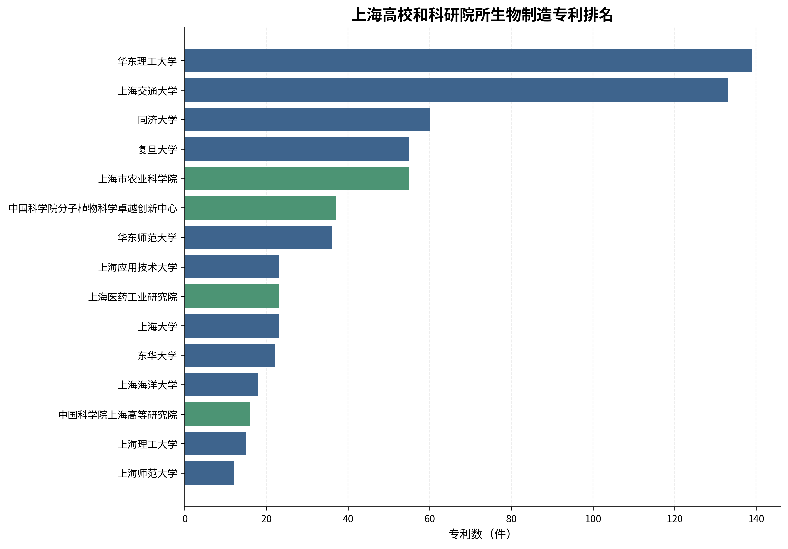

### （二）高校和科研院所技术路线

上海高校的专利主要分布在生物过程与规模化（28.4%）、产品与应用（27.7%）、酶与蛋白质工程（13.5%）、设计工具（13.4%）和细胞工厂（11.7%）。科研院所以产品与应用占比最高（34.1%），设计工具和细胞工厂分别占18.9%和15.7%，生物过程与规模化占21.1%。

与企业相比，高校和科研院所在设计工具、酶工程和细胞工厂等方向占比更高，企业则更集中于生物过程与规模化和产品应用。这一结构差异说明上海科研主体覆盖较多前端和底层技术，但仅凭专利结构不能判断相关成果是否已经向企业转化。

### （三）企业与科研主体技术结构的对应关系

企业、高校和科研院所在产品应用方向均具有较大专利规模，说明该方向具有广泛主体基础。生物过程与规模化在企业中占42.5%，高于高校的28.4%和科研院所的21.1%；设计工具在企业中仅占7.3%，低于高校的13.4%和科研院所的18.9%；细胞工厂在企业中占4.9%，也低于两类科研主体。

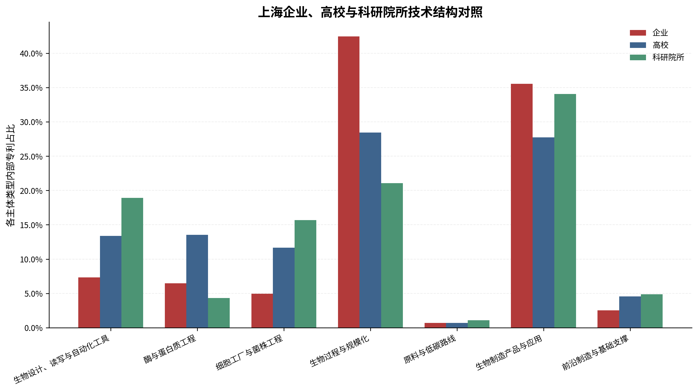

上述差异可用于识别潜在的科研—产业衔接方向，例如设计工具、细胞工厂和酶工程，但不能据此计算合作强度或成果转化率。后续需补充联合申请、技术许可、项目合作和孵化企业数据。

### （四）与重点省市的主体结构比较

以企业、高校和科研院所三类专利合计为分母，上海企业占47.7%、高校占39.8%、科研院所占12.5%。广东企业占55.7%，企业主导特征相对突出；江苏和浙江高校占比分别为60.8%和51.2%；北京三类主体占比较为均衡，科研院所占34.9%；安徽企业和高校各约45%。

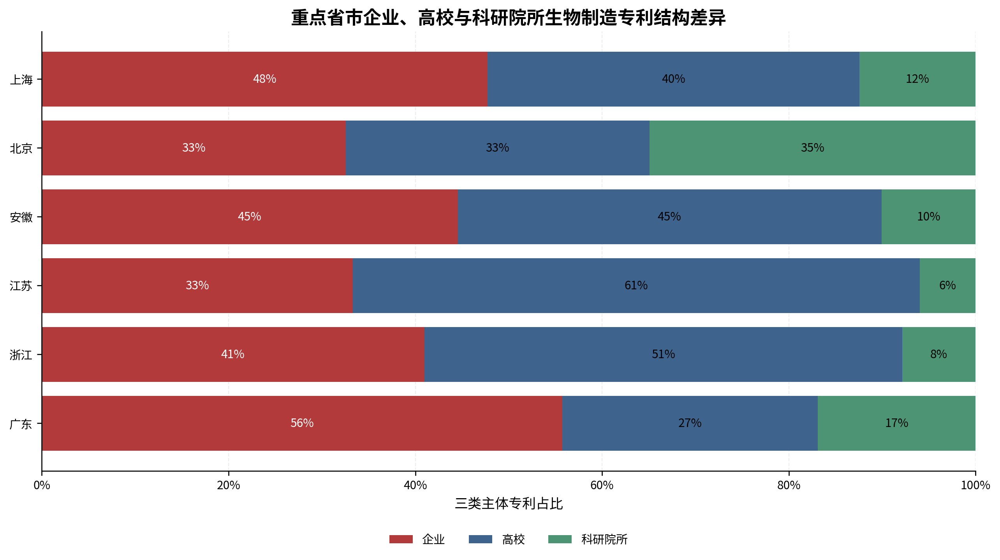

图14仅比较企业、高校和科研院所，未将医疗机构、个人和机关团体纳入分母。该图反映创新主体结构，不能直接解释为成果转化效率。上海的特点是企业和高校均占较大比例，但科研院所占比低于北京，高校占比低于江苏和浙江，企业占比低于广东。

从绝对规模看，上海高校和科研院所专利776件，低于江苏2741件、北京1664件、广东1397件和浙江1128件，高于安徽424件。上海科研主体质量和实际科研影响力不能仅凭专利数量判断，但专利规模差距说明其在当前识别口径下尚未形成与领先地区相当的数量优势。

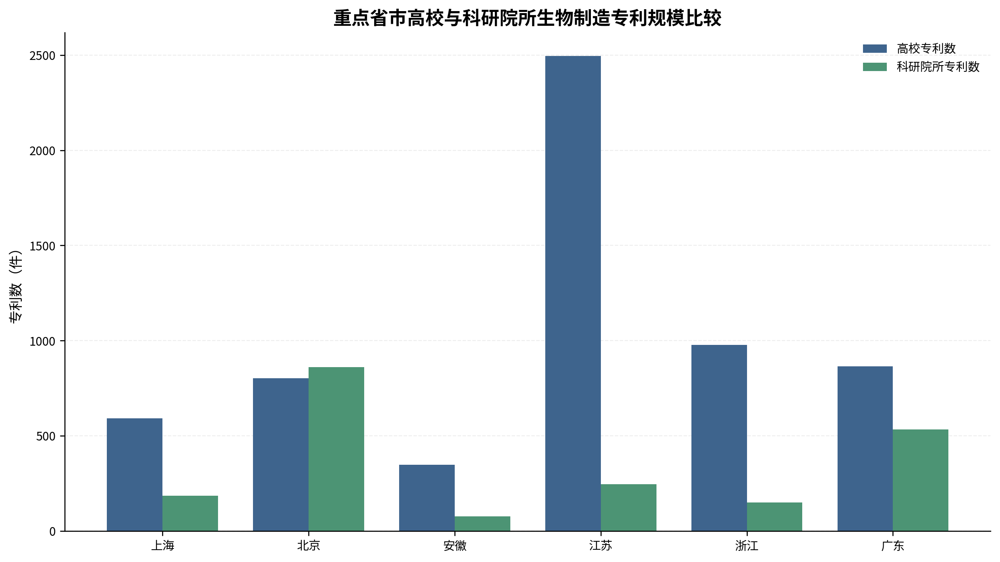

## 第六节 上海及其他地区代表性生物制造企业

### （一）上海代表性企业

**上海凯赛生物技术股份有限公司。** 当前数据中拥有75件相关专利，连续5年均有专利记录，主要方向为生物过程与规模化，并覆盖产品应用、原料与低碳、酶工程和细胞工厂。其专利数量显著高于上海其他企业，属于专利维度的头部候选。正式稿应进一步通过企业公告核验其生物基材料产品、生产基地和商业化情况。

**康码（上海）生物科技有限公司。** 当前数据中拥有17件相关专利，在2022—2024年出现，主要方向为产品与应用，同时覆盖设计工具、前沿制造和细胞工厂。其专利路线较为多元，可作为新型生物技术平台企业候选，但主营产品、技术平台和市场进展仍需通过官网等权威资料核验。

**光明乳业股份有限公司。** 当前数据中拥有10件相关专利，在4个年份出现，主要集中于生物过程与规模化，并覆盖产品应用、细胞工厂、酶工程和设计工具。从专利维度看，其生物制造布局主要与食品发酵、菌种和加工过程相关。正式稿应避免把其全部业务等同于生物制造产业规模。

### （二）其他省市代表性企业

依据专利数量、活跃年份和地区分散原则，当前数据形成的外地候选包括：中国石油化工股份有限公司（北京，103件）、华熙生物科技股份有限公司（山东，50件）、南京启真基因工程有限公司（江苏，42件）、宁夏伊品生物科技股份有限公司（宁夏，38件）和云南中烟工业有限责任公司（云南，36件）。

这些企业分别体现了大型综合工业企业、专门生物技术企业、基因工程企业、发酵产品企业及传统产业应用生物技术等不同类型。候选名单由专利数据产生，并不自动意味着其是全国生物制造市场的前五名。正式报告应根据研究目的，从候选企业中选择技术路线具有代表性且外部信息可核验的3—5家进行案例分析。

### （三）上海与其他省市代表性企业的比较

上海代表性企业中，凯赛生物的专利积累较为突出，其他候选企业专利数量相对有限，呈现“一家突出、专业企业分散”的特征。外地候选既包括专利积累较大的综合工业企业，也包括在特定产品或底层工具方向具有较多专利的专业企业。上海企业在生物过程与规模化和产品应用方面具有较强布局，但与外地部分企业相比，设计工具、酶工程及细胞工厂方向的头部专业企业仍需进一步识别和培育。

该比较目前仅限于专利积累和技术方向。企业经营规模、产品量产和市场地位需要使用公告、政府项目和行业资料补充，不能由专利数量直接推出。

## 第七节 主要问题与政策建议

### （一）主要问题

**一是总体专利规模与领先地区仍有差距。** 上海专利数量位居全国第6，低于江苏、广东、北京和浙江。虽然上海形成较多创新主体，但总量优势尚不突出。

**二是企业主体较多，但持续专利积累企业占比较低。** 上海拥有398家企业，但仅17.1%的企业在两个及以上年份出现专利，三年及以上活跃企业仅16家。受样本窗口影响，这一结果需要谨慎解释，但仍表明企业梯队的持续性值得重点关注。

**三是企业技术布局较集中于制造过程和产品应用。** 两类合计占企业专利的78.0%，设计工具、酶工程和细胞工厂的企业专利占比相对较低。与此同时，高校和科研院所在这些底层方向具有更高占比，科研优势与企业布局之间存在结构差异。

**四是科研主体专利规模未形成全国领先优势。** 上海高校院所专利数量低于江苏、北京、广东和浙江。上海拥有华东理工大学、上海交通大学及多家科研院所等重要主体，但从当前专利数量看，科研供给规模仍有提升空间。

**五是原料与低碳路线的专利布局相对有限。** 上海该方向仅11件专利，其中企业5件。由于该分类口径较窄，不能据此否定上海低碳技术基础，但需要结合生物基原料、废弃物利用和碳源替代项目进一步核验。

### （二）政策建议

**第一，建立分层分类的生物制造企业培育体系。** 对凯赛生物等持续积累主体，重点支持其巩固技术和规模化优势；对设计工具、酶工程、菌株工程等专业企业，强化研发平台、场景验证和首批次应用支持；对仅有少量专利的新主体，纳入动态观察库，结合融资、团队和项目数据筛选成长型企业。

**第二，强化从底层设计到规模制造的中试和工程化衔接。** 上海科研主体在设计工具、细胞工厂和酶工程方面的专利占比高于企业，应围绕菌株验证、发酵放大、分离纯化、质量评价和工艺包开发建设开放式平台。支持政策应明确服务对象、收费机制和成果权益，避免平台建设与企业需求脱节。

**第三，推动优势科研主体与专业企业形成技术方向对接清单。** 以华东理工大学、上海交通大学、中国科学院分子植物科学卓越创新中心等主体为基础，按七条技术路线梳理可工程化成果和企业需求。当前数据不能证明合作关系，后续应结合联合项目、技术许可和孵化企业信息形成真实对接机制。

**第四，围绕相对薄弱方向实施有选择的补强。** 重点关注工业酶、核心菌种、自动化生物铸造、低成本分离纯化和非粮原料利用等方向。对照江苏、浙江在酶工程方面、北京在科研院所和设计工具方面、广东在企业产品应用方面的结构特征，形成差异化布局，而非简单追求专利数量全面赶超。

**第五，完善未来产业动态监测体系。** 将专利识别与工商、融资、项目、产能、人才和产品数据结合，定期更新企业库和技术路线图。对最新年份专利数据设置完整性标识，避免将授权滞后误判为产业波动；对第一申请人类型和城市映射保留人工复核机制，提高跨年度和跨产业比较的一致性。

## 数据口径与局限

1. 本报告仅统计识别为生物制造相关的发明授权专利，不能覆盖未申请专利的技术活动。
2. 以第一申请人作为主要创新主体，未分析共同申请和合作网络。
3. “上海市”和“上海”等城市名称已统一，并通过全国城市参考表映射到省级地区；未识别城市进入审计清单。
4. 合作专利的原始申请人类型可能包含所有申请人的类型，本项目依据第一申请人名称重新识别唯一类型；仍需复核的主体单独标记为其他机构。
5. 医疗机构单独分类，不并入高校、科研院所或企业。
6. 原始13类技术方向在正文归并为7条报告技术路线，该归并服务于咨询报告表达，不是国家统一标准分类。
7. 专利数量、活跃年份和集中度不能替代营业收入、产值、融资、市场份额和商业化水平。
8. 被引证次数字段覆盖率较低，未作为主要质量指标；生物制造识别得分也不代表技术先进性或商业价值。
9. 2025年可能受到专利授权滞后和数据库更新进度影响，年度趋势需要后续完整数据校准。

## 主要外部资料

- [S1] 国家发展改革委：《“十四五”生物经济发展规划》。
- [S2] 国家发展改革委：《生物制造产业是生物经济重点发展方向》。
- [S3] 科技部：《关于支持建设国家合成生物技术创新中心的函》。
- [S4] 科技部：《“十三五”生物技术创新专项规划》。
- [S5] 上海市人民政府办公厅：《上海市加快合成生物创新策源 打造高端生物制造产业集群行动方案（2023—2025年）》。
