# 上海量子信息产业发展情况（初稿）

> **数据说明。** 本稿基于2021—2025年量子信息发明授权专利识别结果形成，以第一申请人为主要创新主体。原始数据中的城市名称已统一，合作专利中的混合申请人类型已依据第一申请人名称重新判断。报告中的专利数量主要反映创新产出和技术布局，不等同于产业产值、市场份额或商业化成熟度。2025年数据仍可能受到专利授权滞后和数据库更新进度影响。

## 内容提要

2021—2025年，中国境内第一申请人共形成量子信息相关发明授权专利7118件。从技术结构看，量子通信与安全、量子计算和量子传感构成主要方向，三者合计占比接近九成；量子计算专利自2023年起增长较快，量子通信与安全保持较大规模，量子传感持续形成较广泛的创新主体基础。

同期，上海共有量子信息相关发明授权专利355件、创新主体85个，专利数量占全国约5.0%，在全国省级地区中位列第6。上海专利数量由2021年的65件增加到2025年的91件，但其全国占比由2021年的8.4%降至2025年的4.9%，说明上海自身专利活动有所增加，但全国尤其是北京、安徽等地区扩张更快。

上海量子信息技术结构呈现“量子通信与安全、量子传感并重”的特征。量子通信与安全专利129件，量子传感121件，两者合计占上海总量的70.4%。量子计算专利数量由2021年的5件增加至2024年和2025年的20件，显示该方向的布局正在扩大；量子计算硬件累计30件，主体基础仍相对有限。

企业方面，上海识别出51家量子信息相关企业，共形成169件专利。前五家企业专利占比为57.4%，集中度低于北京、安徽和浙江，高于广东和江苏，整体处于中等水平。上海企业专利中量子通信与安全占60.4%，明显高于其他重点省市；量子计算专利占14.8%，明显低于北京、安徽、浙江等地，企业技术布局具有较强的通信安全导向。

科研方面，上海高校和科研院所共33个，形成185件专利，数量略高于企业专利。高校院所的专利有50.3%集中在量子传感，21.1%集中在量子计算；企业则主要集中在量子通信与安全。二者形成明显的结构差异，表明上海在科研端拥有较多传感和计算技术储备，但现有数据尚不能判断其成果转化和企业承接情况。

# 第一节 全国量子科技技术路线及专利演进

## （一）主要技术路线

### 1. 量子计算

量子计算利用量子比特的叠加、纠缠和干涉等特性处理信息。与经典比特只能处于0或1不同，量子比特可以形成多种状态的叠加，并通过量子门控制状态演化，因此在部分特定问题上可能形成不同于经典计算的求解路径。本报告中的“量子计算”主要指计算系统、量子算法、量子软件、云平台、纠错和应用探索，不把物理芯片和具体量子比特器件全部放在这一类。现阶段的发展重点是提高可操控量子比特规模和质量、降低噪声、发展纠错与容错能力，并探索量子—经典融合计算在化学模拟、组合优化、机器学习等场景中的可验证价值。[^1][^2]

### 2. 量子通信与安全

量子通信利用量子态不可克隆、测量扰动等性质实现安全密钥生成或量子信息传输。当前较成熟的技术是量子密钥分发，通过光纤或自由空间链路在通信双方之间生成可检测窃听的密钥，再与经典加密系统结合保护信息。进一步的发展方向包括量子中继、量子网络和量子互联网。本报告还把后量子密码等抗量子安全技术纳入“通信与安全”方向，它们主要依靠经典密码算法抵御未来量子计算攻击，技术原理与量子通信不同，但共同服务于量子时代的信息安全体系。该方向的现实重点是网络工程化、设备可靠性、标准互通和行业应用。[^1][^2]

### 3. 量子传感

量子传感和量子精密测量利用原子、光子、自旋等量子体系对时间、频率、磁场、重力、加速度等物理量进行高精度测量。典型技术包括原子钟、冷原子干涉仪、量子磁力计、金刚石NV色心传感器等。其优势并不在于所有场景都优于传统传感器，而在于特定测量对象和极限精度要求下，量子态的稳定性、相干性或对外界扰动的敏感性能够提供新的测量能力。现阶段的发展重点包括提升精度和稳定性、缩小设备体积、降低环境要求，并推动其从实验室系统向导航授时、地球物理、医学检测和工业测量等场景拓展。[^1][^3]

### 4. 量子计算硬件

量子计算硬件是实现量子计算的物理基础，主要包括物理量子比特、量子芯片、操控与读出系统，以及低温、真空、激光和微波等配套设备。当前全球并行探索超导、离子阱、中性原子、光量子、硅自旋和拓扑量子等多种技术路线，各路线在门操作速度、相干时间、制造工艺、扩展方式和运行环境上各有特点，尚未形成单一技术路线全面胜出的格局。硬件发展的核心不只是增加量子比特数量，还要同时提高保真度、连接能力、可校准性和系统稳定性，并解决控制电子学、制冷、封装和规模化制造问题。[^2][^3]

### 5. 量子基础概念

量子基础概念类专利主要围绕量子态、量子纠缠、量子叠加、量子相干等基础原理及其生成、操控、保持和测量展开。这些概念是量子计算、通信和传感的共同理论基础，但相关专利不一定直接对应成熟产品，部分成果更接近实验方法、基础器件或通用控制方案。该方向的重要性在于提升对量子系统的可控制程度，为后续计算、传输和测量提供底层能力。分析这一类别时，应将其理解为基础性和通用性技术储备，不能仅凭专利名称将其直接等同于已经形成产业化应用。

## （二）全国各技术方向专利数量变化

2021—2025年，中国境内第一申请人共形成7118件量子信息相关发明授权专利。其中，量子通信与安全2350件，占33.0%；量子计算2099件，占29.5%；量子传感1726件，占24.2%；量子计算硬件531件，占7.5%；量子基础概念412件，占5.8%。量子通信与安全、量子计算和量子传感是当前专利活动的三大主体方向。

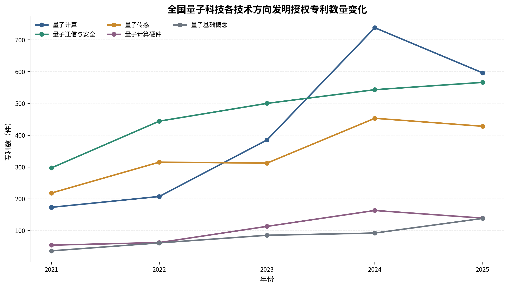

**图1显示，**全国量子信息专利总量由2021年的778件增加至2024年的1989件，2025年为1867件。量子计算增幅最为明显，从2021年的173件增加至2024年的738件，2025年仍有596件；量子通信与安全由297件增加至566件，总量保持在较高水平；量子传感由218件增加至428件，创新主体数量从126个增加至258个，主体覆盖面持续扩大。

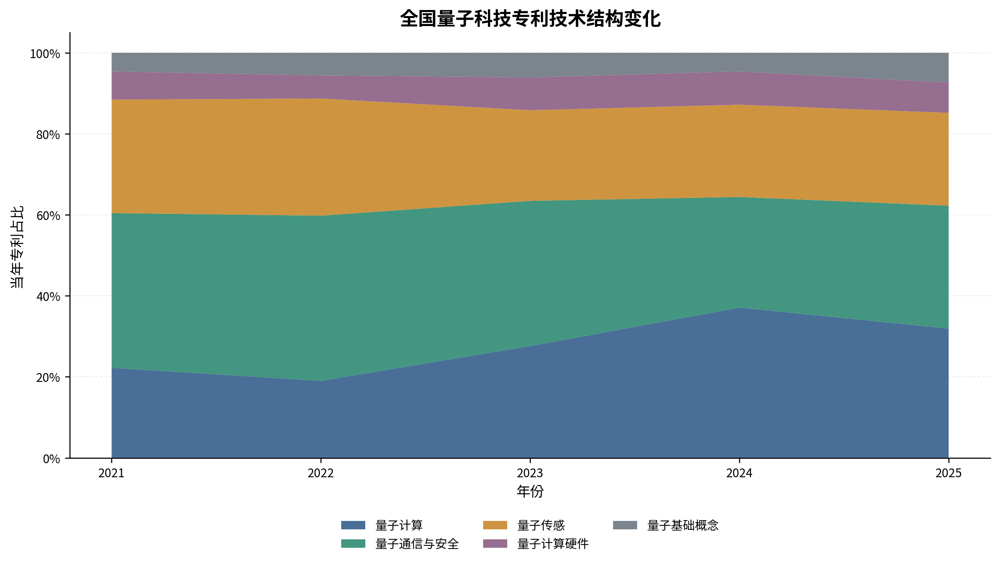

从结构变化看，量子计算占比由2021年的22.2%提高至2024年的37.1%，2025年为31.9%；量子通信与安全占比由38.2%降至2024年的27.3%，2025年回升至30.3%。这并不意味着量子通信专利减少，而是量子计算增长速度更快。量子传感占比总体维持在22%—29%之间。量子计算硬件规模有所扩大，但占比基本保持在6%—8%；量子基础概念专利数量由36件增加至138件，2025年占比上升至7.4%。由于2025年为最新授权年度，相关数量和占比仍需在数据更新后继续校准。

# 第二节 上海量子信息创新发展的总体特征

## （一）创新规模与年度变化

2021—2025年，上海共有量子信息相关发明授权专利355件，涉及85个第一申请人创新主体，占全国专利数量的5.0%，专利数量在全国省级地区中排名第6。上海专利数量在2021—2023年分别为65件、64件和64件，2024年增加至71件，2025年进一步增加至91件；创新主体数量由2021年的24个增加至2025年的40个。

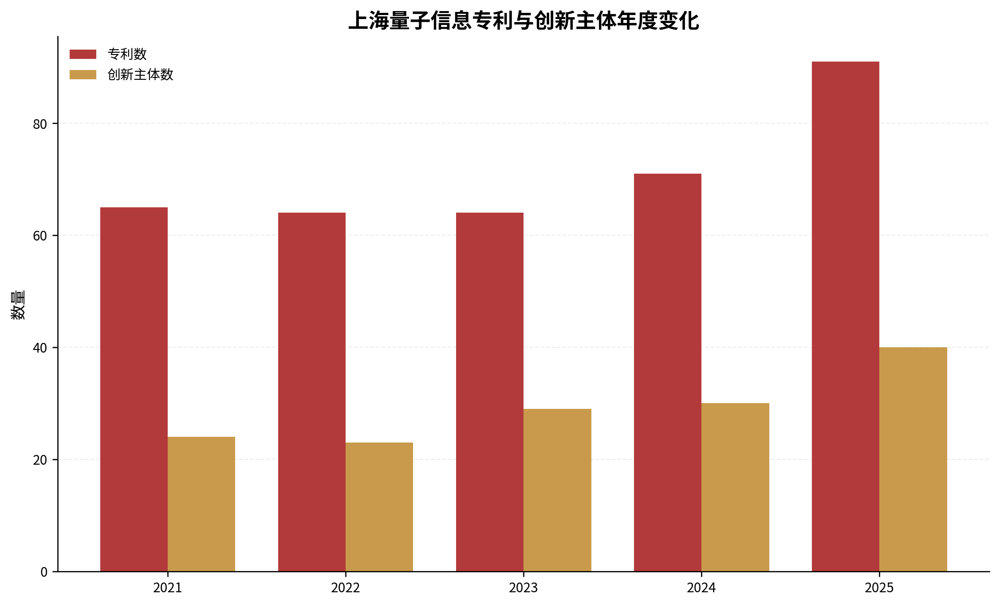

从样本期内变化看，上海前期专利数量相对平稳，2024年以后有所增加。创新主体数量增长快于专利数量，表明更多主体进入量子信息相关专利活动，但也意味着新增主体中相当一部分专利积累较少。由于观察期从2021年开始，不能把2021年以前已有布局与新进入主体完全区分；2025年的上升也需要等待后续完整授权数据进一步验证。

## （二）技术结构特征

上海量子信息技术布局主要集中在量子通信与安全和量子传感。2021—2025年，量子通信与安全专利129件，占36.3%；量子传感121件，占34.1%；量子计算64件，占18.0%；量子计算硬件30件，占8.5%；量子基础概念11件，占3.1%。量子通信与安全和量子传感合计占70.4%，构成上海最主要的两类技术方向。

上海量子计算专利数量由2021年的5件增加至2023年的13件，2024年和2025年均为20件，样本期内呈现较为明显的扩展。量子通信与安全每年保持21—29件，表现相对稳定。量子传感在2021—2022年数量较多，2024年回落后2025年有所恢复。量子计算硬件在2023年未形成记录，2024年和2025年分别达到10件和12件，说明相关布局有所增加，但累计专利和主体数量仍有限。

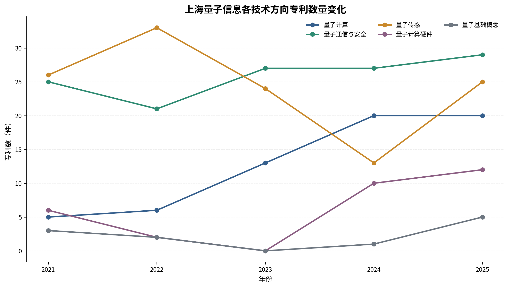

## （三）与重点省市比较

从累计规模看，北京、安徽、江苏、广东和浙江分别拥有1568件、1310件、747件、625件和536件相关专利，均高于上海。北京专利和创新主体数量均居首位；安徽专利数量居第2，但创新主体仅92个，专利高度集中于少数主体；广东创新主体达到220个，主体数量明显多于上海，专利分布更为分散。上海85个创新主体少于北京、江苏、浙江和广东，与安徽接近，但专利数量仅为安徽的27.1%。

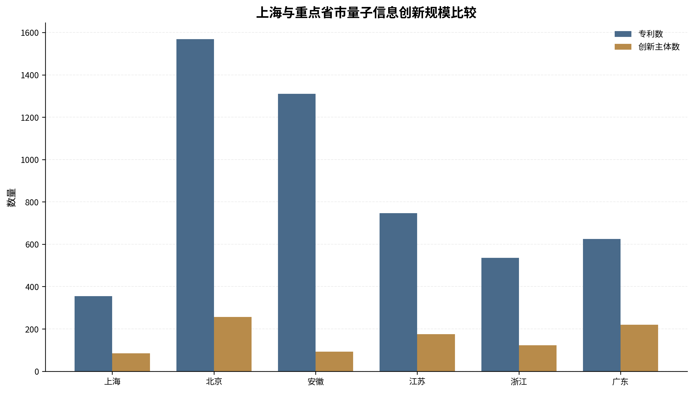

年度比较显示，上海专利数量从65件增加至91件，但全国占比从8.4%下降至4.9%，年度排名由第5位波动至第7位。这表明上海专利活动并未停滞，但全国其他优势地区扩张更快。上海技术结构也具有明显差异：量子通信与安全和量子传感比重较高，量子计算比重低于北京和安徽。相较江苏、浙江和广东，上海总量较小，但高校院所专利占比相对较高，科研主体在上海技术布局中具有重要作用。

# 第三节 上海量子信息企业主体与发展梯队

## （一）企业规模与年度变化

经重新判断第一申请人类型，上海共有51家企业形成169件量子信息相关发明授权专利，企业专利占上海全部相关专利的47.6%。企业年度专利数由2021年的27件增加至2024年的42件，2025年为41件；年度活跃企业由12家增加至19家。企业数量的增加说明参与量子信息专利活动的企业范围扩大，但企业平均专利数仅为3.3件，多数企业仍处于少量布局状态。

样本期内，2022—2025年首次出现在数据中的企业分别为5家、12家、11家和11家。这里的“新进入”仅表示企业在2021—2025年专利样本中首次出现，并不代表企业当年成立或首次进入量子科技领域，因而主要用于观察专利活动主体的变化。

## （二）企业梯队与头部集中度

上海企业专利数量排名前三的主体为国科量子通信网络有限公司、上海循态量子科技有限公司和上海国盾量子信息技术有限公司，分别拥有47件、19件和13件专利，均以量子通信与安全为主要技术方向。上海图灵智算量子科技有限公司和上海裕达实业有限公司分别拥有9件专利，主要布局量子计算和量子计算硬件；建信金融科技有限责任公司、上海量羲技术有限公司等主体在量子计算或计算硬件方向形成了较少但连续的专利活动。

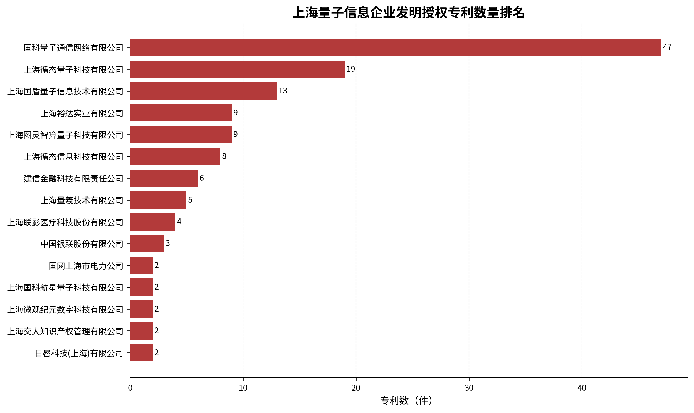

从集中度看，上海第一家企业占企业专利总量的27.8%，前三家占46.7%，前五家占57.4%，前十家占72.8%，HHI为0.109。上海企业专利既存在较为明确的头部主体，也保留了一定数量的中小规模创新主体。需要注意的是，专利集中度只反映专利数量分布，不能直接用于判断市场垄断程度。

## （三）企业创新持续性

上海51家企业中，10家在两个及以上年份形成相关专利，占19.6%；6家在三个及以上年份形成专利。国科量子通信网络有限公司覆盖全部5个年份，上海循态量子科技有限公司覆盖4个年份，上海国盾量子信息技术有限公司覆盖3个年份。上海图灵智算量子科技有限公司、上海裕达实业有限公司等也覆盖4个年份。总体看，上海已形成少量持续布局企业，但大多数企业只在单一年份出现，企业梯队的稳定性仍需结合后续年度数据观察。

## （四）与重点省市比较

上海企业数量和企业专利数均低于五个重点省市。北京、安徽、江苏、浙江和广东分别有155家、67家、130家、82家和168家企业；企业专利分别为832件、1029件、362件、337件和417件。上海企业平均专利数为3.3件，高于广东和江苏，低于北京、浙江，明显低于安徽。

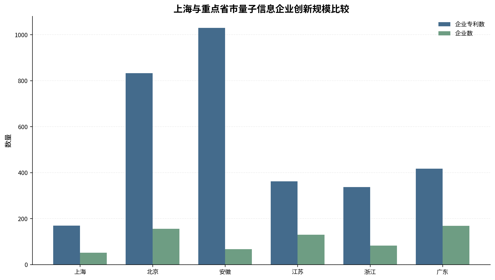

上海企业CR5为57.4%，低于安徽的75.1%、浙江的63.5%和北京的59.9%，高于广东的41.5%和江苏的41.2%。这说明上海企业专利集中度并非最高，但头部企业的规模仍与外地领先企业存在明显差距。上海多年活跃企业占比为19.6%，与北京接近，低于安徽和浙江，高于广东和江苏。综合看，上海具有一定的头部和持续创新主体，但企业总量、头部专利积累和第二梯队厚度仍有提升空间。

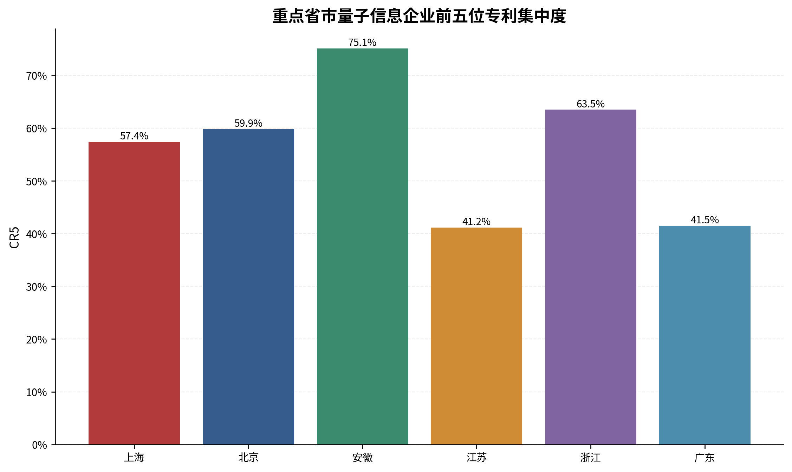

# 第四节 上海量子信息企业技术布局

## （一）企业技术方向分布

上海企业的169件相关专利中，量子通信与安全102件，占60.4%；量子传感27件，占16.0%；量子计算25件，占14.8%；量子计算硬件13件，占7.7%；量子基础概念2件，占1.2%。企业技术布局明显集中在量子通信与安全，且主要由国科量子通信网络、上海循态量子科技、上海国盾量子信息技术等企业支撑。

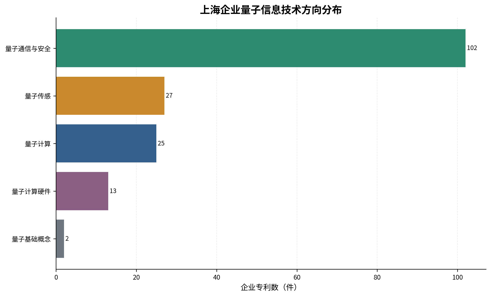

虽然量子计算企业专利数量低于量子通信，但已出现上海图灵智算量子科技、建信金融科技、上海量羲技术等主体；量子计算硬件方向的企业数量仅3家，专利13件，企业基础相对有限。量子传感涉及24家企业，但平均每家专利数量较少，说明该方向主体分布较广、头部企业尚不突出。

## （二）重点企业的技术布局差异

上海前三家代表性企业均以量子通信与安全为主要技术方向，反映出上海头部企业专利布局具有较强的同质性。国科量子通信网络有限公司在样本期内拥有47件专利且连续5年活跃，专利集中在量子通信与安全；上海循态量子科技有限公司除通信安全外还涉及少量量子基础概念；上海国盾量子信息技术有限公司的13件专利也集中在量子通信与安全。

在第二梯队中，上海图灵智算量子科技有限公司主要布局量子计算和量子计算硬件，上海裕达实业有限公司主要集中在量子计算硬件，上海联影医疗科技股份有限公司的相关专利主要属于量子传感。这些主体为上海技术结构提供了一定多样性，但专利规模与通信类头部企业仍有差距。

## （三）与重点省市比较

上海企业专利中量子通信与安全占60.4%，高于江苏的48.3%、浙江的46.6%、广东的41.5%、北京的34.0%和安徽的31.2%，是六个重点省市中通信安全导向最突出的地区。相应地，上海企业量子计算专利占14.8%，低于北京的40.3%、安徽的51.2%、浙江的38.0%、江苏的24.3%和广东的22.8%。

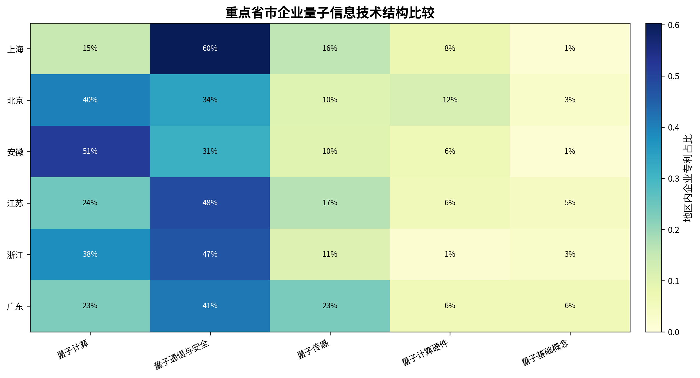

上海企业量子传感占比为16.0%，与江苏接近，高于北京、安徽和浙江，低于广东；量子计算硬件占比为7.7%，低于北京，高于安徽、江苏、浙江和广东，但上海该方向只有3家企业，规模基础仍较薄。总体而言，上海企业在量子通信与安全方向形成相对鲜明的专业化特征，而量子计算及其硬件方向与北京、安徽等地存在较大规模差距。

# 第五节 上海高校和科研院所的技术支撑

## （一）科研主体规模与代表性机构

上海共有33个高校和科研院所第一申请人，形成185件相关专利，专利数量略高于企业的169件。上海交通大学以42件专利居首，主要涉及量子传感，并覆盖量子计算、通信、硬件和基础概念；复旦大学和中国科学院上海微系统与信息技术研究所各有19件；华东师范大学15件；中国科学院上海光学精密机械研究所13件；中国科学院微小卫星创新研究院和华东计算技术研究所各有10件。

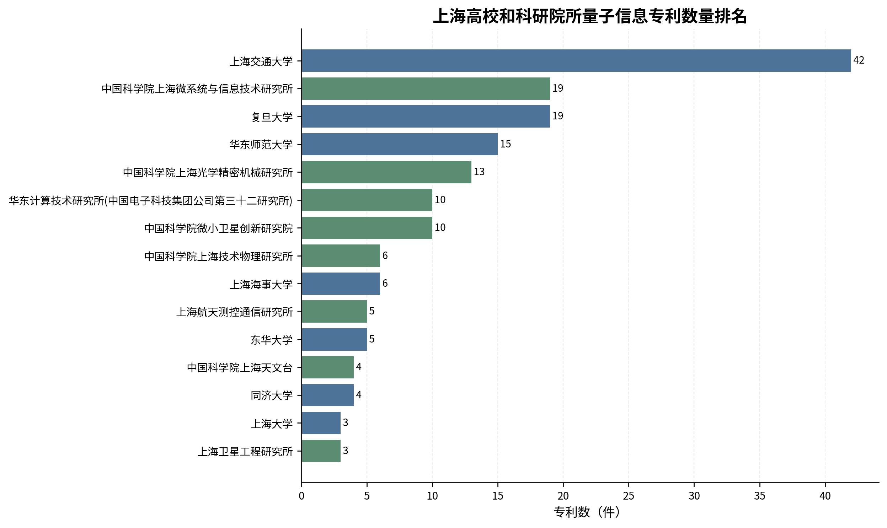

上述科研主体多数覆盖多个年份和多个技术方向，构成上海量子信息创新的重要基础。其中，上海交通大学、复旦大学、华东师范大学在样本期5年均有相关专利；中国科学院上海微系统所、上海光机所等科研院所也保持了较为持续的专利活动。

## （二）科研主体的技术方向

上海高校和科研院所的185件专利中，量子传感93件，占50.3%；量子计算39件，占21.1%；量子通信与安全27件，占14.6%；量子计算硬件17件，占9.2%；量子基础概念9件，占4.9%。科研主体的技术结构与企业明显不同，量子传感和量子计算构成主要方向。

高校和科研院所内部也存在差异。上海交通大学、复旦大学、华东师范大学和上海光机所在量子传感方向较为活跃；上海微系统所、上海海事大学等主体在量子计算或计算硬件方向形成布局；微小卫星创新研究院、上海技术物理研究所等机构则在量子通信与安全、量子传感等方向形成专利积累。

## （三）企业与高校院所技术结构对照

上海企业和高校院所的技术结构形成较强反差：企业量子通信与安全占60.4%，高校院所仅占14.6%；高校院所量子传感占50.3%，企业仅占16.0%；高校院所量子计算占21.1%，也高于企业的14.8%。量子计算硬件在企业和高校院所中的占比分别为7.7%和9.2%，均处于较低水平。

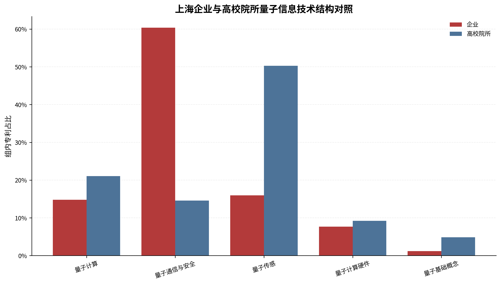

这一结构说明，上海企业端的通信安全布局较突出，科研端则在传感和计算方面拥有更多专利储备。二者是否已经形成有效转化和企业承接，不能由第一申请人专利数据直接判断，但这种结构差异提示后续需要进一步结合专利共同申请、转让许可、企业产品和科研成果产业化数据进行验证。

## （四）与重点省市比较

北京高校院所拥有703件专利、83个主体，显著高于其他地区；江苏379件、40个主体；安徽279件、23个主体；广东198件、44个主体；浙江194件、38个主体；上海185件、33个主体。上海高校院所专利规模在六个地区中最低，与浙江和广东相对接近，但明显低于北京和江苏。

上海科研主体数量多于安徽，但专利数量仅为安徽的66.3%，说明安徽的科研专利集中度和单个主体专利积累更高。与北京相比，上海在科研主体数量和专利规模上均存在较大差距；与江苏、浙江和广东相比，上海科研主体数量并不突出，但量子传感占比较高，形成一定技术结构特征。

# 第六节 上海及其他地区代表性量子信息企业

## （一）上海三家代表性企业

### 1. 国科量子通信网络有限公司

专利数据显示，该企业2021—2025年共有47件量子信息相关发明授权专利，是上海专利数量最多的企业，并且连续5年形成专利，全部集中在量子通信与安全方向。公开资料显示，国科量子由中国科学院有关国有资本平台与中国科学技术大学在上海浦东发起成立，主要围绕量子通信网络建设和运营开展业务。[^4] 从专利数据看，该企业构成上海量子通信企业群体的核心主体，但当前数据不能直接判断其营业收入、市场份额和项目运营效益。

### 2. 上海循态量子科技有限公司

该企业共有19件相关专利，覆盖2021、2023、2024和2025年，主要技术方向为量子通信与安全，同时涉及少量量子基础概念。其专利数量居上海企业第2位，说明在样本期内形成了较为集中的技术布局。由于当前尚缺乏经过权威来源核验的企业产品、经营规模和市场应用资料，本稿仅将其作为专利创新活动较为突出的上海企业案例，不对其市场地位作进一步判断。

### 3. 上海国盾量子信息技术有限公司

该企业共有13件相关专利，覆盖2021—2024年的3个年份，主要集中于量子通信与安全。从专利结构看，其技术方向与上海前两家企业相近，进一步体现上海头部企业群体的通信安全导向。企业产品、客户和与母公司的业务关系需要在正式稿中依据企业官网、上市公司公告或政府资料进一步核验。

## （二）其他省市三至五家代表性企业

从上海以外全国企业专利积累看，本源量子计算科技（合肥）股份有限公司拥有417件相关专利，主要技术方向为量子计算，并覆盖量子传感、计算硬件、基础概念和通信安全。其专利数量明显高于其他候选企业。企业官方平台显示，其业务覆盖量子计算云服务、编程工具、量子软件和应用开发等内容。[^5]

北京百度网讯科技有限公司拥有317件相关专利，主要归入量子计算，并覆盖五个技术方向。需要注意，大型综合科技企业的专利布局可能与其整体研究体系有关，当前专利数量不能直接证明量子业务已形成相应商业规模，正式稿需要核验其当前量子业务组织和产品状态。

科大国盾量子技术股份有限公司拥有152件专利，主要方向为量子通信与安全，同时涉及量子计算和基础概念。企业官网显示，其业务覆盖量子通信、量子计算和量子精密测量相关产品及技术服务。[^6]

如般量子科技有限公司拥有151件专利，连续5年形成相关专利，主要方向为量子计算，同时涉及量子通信与安全。国开启科量子技术（北京）有限公司拥有92件专利，主要方向为量子通信与安全，同时覆盖量子计算、计算硬件和量子传感。这两家企业的具体产品和业务情况仍需在正式写作阶段使用企业官网和政府资料核验。

## （三）上海与外地代表性企业的差异

从专利积累看，上海排名第一的企业拥有47件专利，明显少于本源量子的417件、百度网讯的317件，以及科大国盾和如般量子的150件以上。上海前三家代表性企业均主要集中在量子通信与安全，而外地案例中既有量子通信企业，也有量子计算系统、软件和综合技术布局企业，技术方向更加多样。

上海代表性企业的优势在于通信安全方向形成了较为清晰的专业化群体，且国科量子等企业保持多年专利活动；其不足是量子计算类头部企业的专利积累相对有限，量子计算硬件企业尚未形成与北京、安徽领先主体相当的规模。需要强调，以上差异是专利数据意义上的比较，企业产品化程度、经营能力和行业影响力必须结合更多公开资料后再作判断。

# 第七节 主要问题与政策建议

## （一）主要发现与问题

第一，上海量子信息专利数量和创新主体有所增加，但全国相对位势承压。上海专利数量由2021年的65件增加至2025年的91件，但全国占比下降，累计规模仅为北京的22.6%、安徽的27.1%，与全国领先地区存在明显差距。

第二，企业技术布局较集中于量子通信与安全。该方向占上海企业专利的60.4%，高于五个重点对比省市；量子计算企业专利占比仅14.8%，量子计算硬件仅13件、3家企业。通信安全构成上海鲜明优势，但技术结构相对集中。

第三，企业主体数量有所扩大，但持续创新企业占比较低。上海51家企业中只有10家覆盖两个及以上年份，6家覆盖三个及以上年份，多数企业专利积累较少。上海CR5处于中等水平，既有头部主体，也存在第二梯队规模不足的问题。

第四，科研端与企业端的技术结构差异明显。高校院所量子传感和量子计算专利占比较高，企业则集中于量子通信与安全。当前数据不能证明成果转化不足，但提示科研技术储备与现有企业专利布局之间存在结构差异，需要进一步核验技术转移和企业承接情况。

第五，上海代表性企业在专利积累和技术多样性方面与外地领先主体存在差距。上海前三家案例集中于量子通信与安全，而安徽、北京、浙江等地已经出现专利规模较大的量子计算或综合布局企业。

## （二）政策建议

一是巩固量子通信与安全优势，同时推动技术结构适度多元化。支持现有通信安全企业围绕网络可靠性、标准互通和行业应用持续形成技术积累，并将量子计算、量子传感和量子计算硬件作为新增企业培育和项目布局的重要方向，避免企业创新长期集中于单一技术领域。

二是围绕量子计算和计算硬件形成更有针对性的企业培育机制。结合上海在微电子、集成电路、精密仪器、软件和高性能计算方面的产业基础，重点关注已有连续专利活动的量子计算和硬件企业，以及具备相关技术能力的传统科技企业。政策支持应更多依据技术方向、持续创新记录和可核验产品进展，而非单纯依据企业数量。

三是建立量子信息企业分层动态监测库。根据专利积累、活跃年份和技术方向，将企业划分为持续布局企业、专业化企业、新进入观察企业和待复核主体，并结合工商、融资、产品、项目和人才数据定期更新。对于仅有一件专利或单一年份出现的企业，不宜过早认定为重点企业。

四是加强科研技术储备与工程化需求的对接。上海高校院所在量子传感和量子计算方向拥有较多专利，可围绕样机验证、测试评价、工程设计和应用需求建立更明确的项目机制。现阶段应先补充专利转让、共同申请、技术合同和企业产品数据，识别真正具有转化条件的科研成果，再实施差异化支持。

五是加强与全国优势地区的错位协同。北京在综合科研和量子计算方面规模较大，安徽在量子计算和量子通信头部企业方面优势明显，江苏和浙江拥有较多企业和科研主体，广东企业数量多、技术布局较分散。上海可重点发挥长三角协同和应用场景优势，在保持自身通信安全、传感和精密测量特色的同时，吸引量子计算和硬件企业在沪设立研发、应用和服务节点。

六是完善监测指标，避免仅用专利数量评价未来产业。后续应补充企业营业状态、研发投入、融资、产品、订单、应用场景、人才和科研成果转化等数据，并对最新年份专利数据持续更新。专利指标适合识别技术布局和创新主体，只有与产业和经营数据结合，才能形成更完整的政策判断。

## 数据口径与局限

1. 本报告仅使用识别得到的发明授权专利，未纳入发明申请、实用新型和软件著作权。
2. 以第一申请人作为主要创新主体，不能完整反映共同申请人和合作网络。
3. 城市统一和省份映射依据全国行政区参考表，后续新城市若未映射将进入审计清单。
4. 第一申请人类型依据名称规则重新判断，极少数复杂主体仍需人工核验；本版当前审计未发现待复核记录。
5. 技术分类依赖专利文本关键词和规则，适合形成总体结构，不代表官方产业分类。
6. 被引证次数字段覆盖率较低，本稿未将其作为专利质量指标。
7. 2025年为最新授权年度，可能存在授权滞后或数据更新不完整问题。
8. 企业代表性主要依据专利数量、活跃年份和技术方向，不等同于市场地位或政府认定的龙头企业。

---

[^1]: 国家发展改革委：《“十四五”规划〈纲要〉名词解释之11｜量子信息》，2021年12月24日。
[^2]: 中国信息通信研究院：《量子信息技术发展与应用研究报告（2025年）》及2024年版报告。
[^3]: 中国科学院学部：潘建伟院士关于我国量子信息科技发展的介绍，2025年1月14日。
[^4]: 人民网上海频道：《未来产业赢领明天｜国科量子公司：在量子保密通信新赛道上发力》，2024年1月11日。
[^5]: 本源量子官方量子计算云平台。
[^6]: 科大国盾量子技术股份有限公司官方网站“公司简介”。
