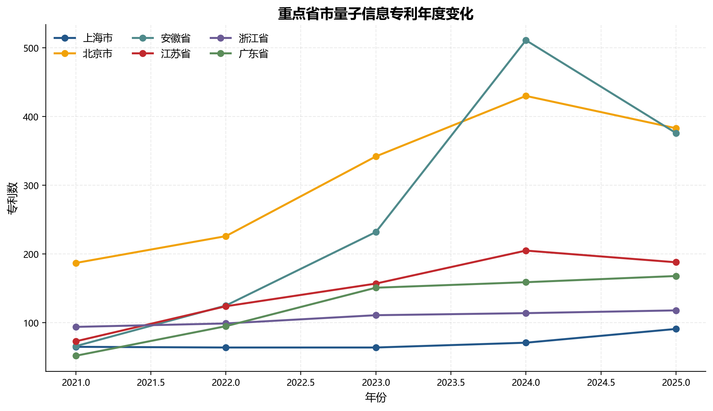
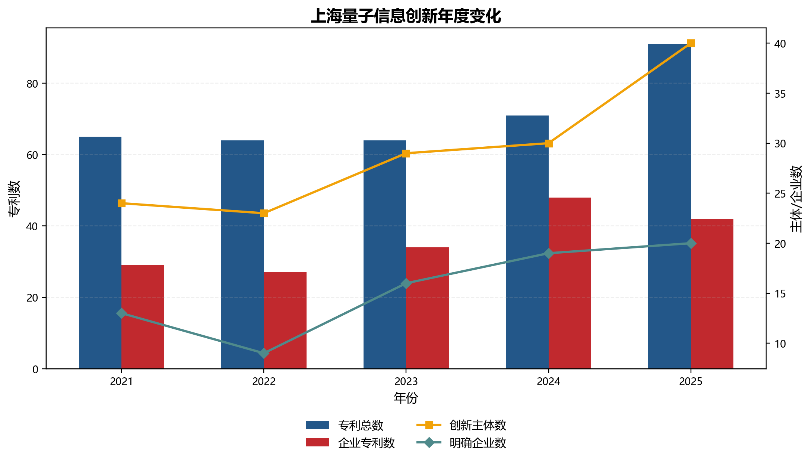
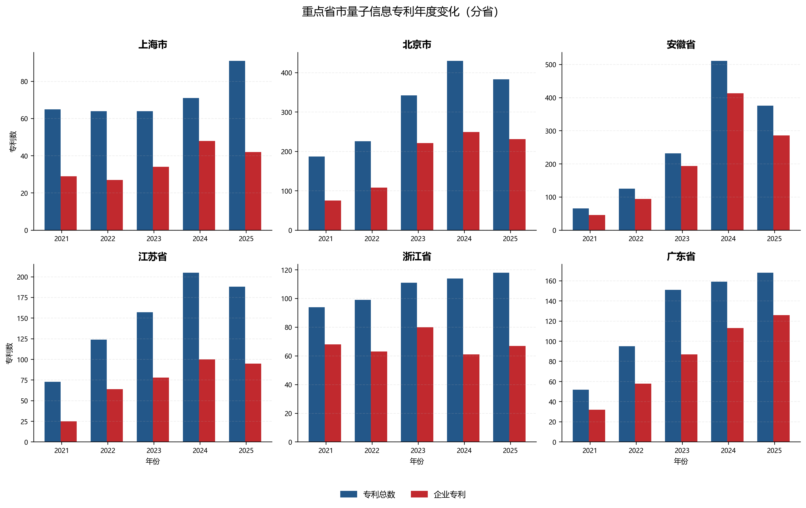
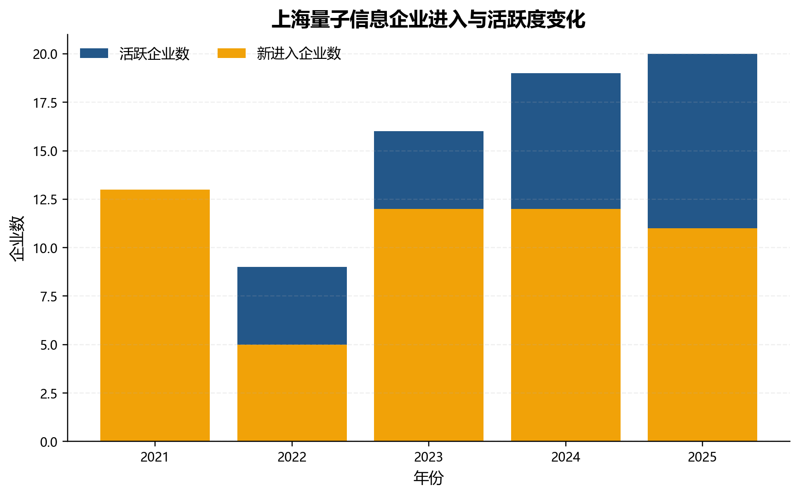
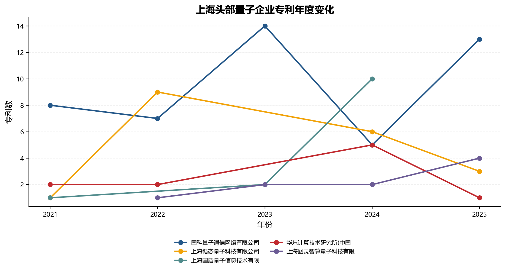
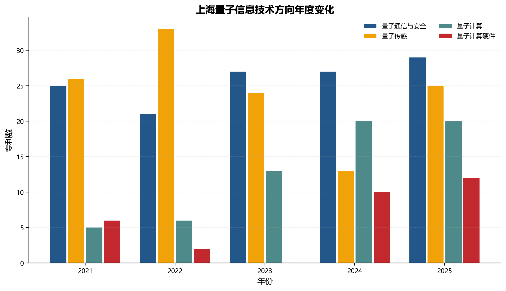

# 上海量子信息产业发展情况（咨询报告·面板数据版）

> **数据年份：** 2021—2025年面板数据（跨省比较以2021—2023年为主要窗口，详见"数据口径与局限"）
> **数据来源：** 中国发明授权专利识别结果，全量7,398条记录、1,615个第一申请人
> **统计口径：** 第一申请人所在地（城市→省份映射）；企业统计采用"明确识别为企业"保守口径；严格核心专利 = 高相关 + 中相关；PNT候选 = 原子钟/时间频率/精密计量
> **核心约束：** 2024—2025年因城市字段格式变更，4,201条记录（56.8%）未能映射到省级地区，跨省比较仅以2021—2023年为可靠窗口。专利数据反映技术创新布局，不能代替产业规模、营收、市场份额和产品落地评价。

## 摘要

本报告基于2021—2025年量子信息相关发明授权专利面板数据，对上海量子信息创新发展的规模、趋势、主体结构和技术布局进行系统分析。考虑到2024—2025年数据存在城市映射不完整问题，跨省比较和趋势分析以2021—2023年为主要窗口。

**核心发现：**

**规模增长停滞。** 2021—2023年，上海量子相关专利从65件略降至64件，基本持平；而同期北京从187件增至342件（+83%），安徽从66件跃升至231件（+250%），江苏从73件增至149件（+104%），广东从52件增至142件（+173%）。上海从2021年的全国第5位下滑至2023年的第7位（不计"待映射"），与领先省市的差距急剧拉大。

**企业主体增加但头部企业增长乏力。** 上海量子企业从2021年的13家增至2023年的16家，三年累计新进入17家。但80%的企业（24家/30家）仅有1—2年活跃记录，企业基数扩大并未转化为头部企业专利规模提升。前三大企业（国科量子通信29件、循态量子10件、循态信息8件）均集中于量子通信方向，与安徽本源量子（341件，含2024—2025年数据）和浙江如般量子（127件）的差距极为悬殊。

**技术结构有所改善但仍高度集中。** 五年累计数据中，量子计算方向专利增至24件（12.1%），量子计算系统增至21件（10.6%），出现了量子软件/算法/模拟（3件）和上游材料（1件）的首批专利。但量子传感和量子通信仍合计占80%以上，量子计算整机和软件栈仍远未形成规模。

**高校科研底蕴深厚但企业转化不足。** 上海交通大学以33件专利位居全市首位，中科院上海微系统所（9件）等新主体进入排名。但企业端的技术方向与科研端存在显著错位：企业专利65.8%集中于量子通信，高校院所在量子计算硬件、量子传感和量子基础方向的优势尚未转化为企业产出。

**城市映射问题是当前数据最大制约。** 2024—2025年有4,201条记录（含上海大量潜在数据）因城市字段格式变更落入"待映射"类别，亟待补充映射文件后重新分析。

## 第一章 全国格局与上海位势：从持平到落后

### 一、2021—2023年：六省市增长态势严重分化

2021—2023年是我国量子信息专利快速扩张的三年。六省市合计专利数从537件增至1,024件，增长91%。但增长分布极不均衡（表1）：

- **高增长组**：安徽（+250%）、广东（+173%）、江苏（+104%）、北京（+83%）——四年均保持25%以上年均增速。
- **停滞组**：浙江从94件微增至96件（+2.1%），上海从65件微降至64件（-1.5%）——两省市基本原地踏步。

这一分化在2023年尤为显著：北京的342件已接近上海的5.3倍，安徽的231件是上海的3.6倍。在2021年，这些倍数分别为2.9倍和1.0倍。上海不仅在绝对规模上落后，更在增长速度上被拉开了决定性差距。

**表1  2021—2023年六省市量子信息专利年度变化**

| 地区           |       2021年 |       2022年 |       2023年 |  2021→2023变化 |        年均变化 |
| -------------- | -----------: | -----------: | -----------: | --------------: | --------------: |
| 北京           |          187 |          226 |          342 |            +83% |          +35.3% |
| 安徽           |           66 |          123 |          231 |           +250% |          +87.1% |
| 江苏           |           73 |          115 |          149 |           +104% |          +43.0% |
| 广东           |           52 |           92 |          142 |           +173% |          +65.5% |
| 浙江           |           94 |           91 |           96 |           +2.1% |           +1.1% |
| **上海** | **65** | **64** | **64** | **-1.5%** | **-0.8%** |

> 资料来源：根据地区年度趋势CSV整理。2024—2025年因映射问题不可靠，暂不列入跨省比较。

### 二、企业专利增长同样落后

企业端的数据更为严峻。上海企业专利从2021年的29件增至2023年的34件（+17%），而同期北京从75件增至221件（+195%）、安徽从46件增至193件（+320%）、江苏从25件增至77件（+208%）。企业是产业化的主力军，企业专利增速差距直接意味着产业竞争力差距的拉大。

上海企业专利占全市量子专利的比例从2021年的44.6%升至2023年的53.1%，这一"占比提升"并非因为企业专利绝对量增长强劲，而是因为总量持平——分母不变，分子微增。这与北京（从40.1%升至64.6%）和安徽（从69.7%升至83.5%）"量占比齐升"的态势完全不同。

### 三、五年累计截面：与领先省市的综合差距

从2021—2025年累计数据看（表2），上海198件量子专利在已映射省市中排名第7位（计入"待映射"则为第8位），落后于北京（764件）、安徽（431件）、江苏（352件）、广东（289件）、浙江（282件）和四川（140件）。上海198件仅为北京的25.9%、安徽的45.9%。

在结构指标上，上海的低严格核心占比（66.7%，六省市最低）和高PNT占比（28.8%，六省市最高）与单年分析一致，说明这一特征不是单年波动而是持续模式。

**表2  2021—2025年累计六省市量子创新指标比较**

| 地区           |        专利数 |       主体数 |       企业数 |   企业专利数 |        企业占比 |    严格核心占比 |        PNT数 |             CR1 |             HHI |
| -------------- | ------------: | -----------: | -----------: | -----------: | --------------: | --------------: | -----------: | --------------: | --------------: |
| 北京           |           764 |          137 |           67 |          406 |           53.1% |           80.8% |          103 |           36.7% |           0.164 |
| 安徽           |           431 |           41 |           29 |          340 |           78.9% |           94.7% |            5 |           25.3% |           0.170 |
| 江苏           |           352 |           87 |           60 |          170 |           48.3% |           83.8% |           27 |           16.5% |           0.070 |
| 广东           |           289 |           86 |           57 |          168 |           58.1% |           87.2% |           22 |           12.5% |           0.064 |
| 浙江           |           282 |           39 |           24 |          203 |           72.0% |           90.4% |           16 |           62.6% |           0.416 |
| **上海** | **198** | **50** | **30** | **94** | **47.5%** | **66.7%** | **57** | **30.9%** | **0.129** |

> 注：2024—2025年数据映射不完整，上海及外省市实际专利数可能高于表列值。本表仅反映已映射到省级地区的记录。

**图1展示了六省市累计专利和主体数的比较。**

从上海自身的时间维度来看，图9揭示了上海量子创新在2021—2023年间"总量持平、结构波动"的微观特征：专利总数在64—65件之间窄幅波动，但创新主体数从24个增至29个，明确企业数从13家先降后升至16家。企业数量的回升反映了新进入者的涌入，但企业专利数仅从29件微增至34件，说明新进入企业以微量专利为主。

**图9用双轴图同时展示了上海在专利数、企业专利数、创新主体数和明确企业数四个维度上的年度变化。** 图中清晰可见，蓝色和红色柱体（专利总数和企业专利数）三年间几乎等高水平，而橙色和紫色折线（创新主体数和明确企业数）则呈现先降后升的走势，表明2022年企业出现了明显退出，2023年又有大批新企业进入。

六省市分省对比（图10）更加直观地展示了增长分化的严重程度。北京和安徽的柱体在三年间急剧增高，广东和江苏紧随其后，而上海和浙江的柱体高度几乎没有任何变化。

**图10以六宫格布局分别展示每个省市的专利总数和企业专利数的年度变化。** 蓝色柱为专利总数，红色柱为企业专利数。从图中可以直观判断：北京和安徽的总量增长主要由企业端驱动（红色柱快速增长），而上海和浙江两个指标均停滞。

## 第二章 企业主体：数量扩张但质量未升

### 一、企业数量增长与结构性脆弱

2021—2023年间，上海量子企业数量从13家增至16家，三年累计出现30家明确企业（含已退出和新进入）。从新进入企业数据看（表3），上海2022年新进入5家（新进入率55.6%），2023年新进入12家（新进入率75.0%），新进入比例在六省市中处于较高水平（仅次于江苏的85.7%）。

然而，企业数量的增加并未转化为专利规模的扩大。30家企业中：

- **仅1年活跃**：24家（80.0%），其中14家仅有1件专利
- **2年活跃**：3家（10.0%）
- **3年及以上活跃**：3家（10.0%）——国科量子通信（3年）、国盾量子信息（3年，含2024年）、及循态量子（2年）

企业持续性数据的核心结论是：上海量子信息企业的"进入率"尚可，但"存活率"和"成长率"堪忧。大量企业仅在某一年出现过量子专利，可能为偶发性参与或项目制研发，而非持续经营的量子专业企业。

**表3  2021—2023年上海量子企业新进入与活跃度**

| 年份 | 活跃企业数 | 新进入企业数 | 新进入占比 | 累计出现企业数 |
| ---- | ---------: | -----------: | ---------: | -------------: |
| 2021 |         13 |           13 |     100.0% |             13 |
| 2022 |          9 |            5 |      55.6% |             18 |
| 2023 |         16 |           12 |      75.0% |             30 |

> 资料来源：根据新进入企业年度统计和持续性明细CSV整理。2024年数据仅1家活跃企业，可能受映射问题影响，未列入。

**图11直观展示了上海量子企业活跃数量与新进入数量的年度变化。** 2022年活跃企业数从13家降至9家——有4家企业退出——但新进入5家部分弥补了这一缺口。2023年活跃企业数跃升至16家，其中12家为新进入，新进入率达到75.0%。这一"高频进入、高频退出"的模式表明上海量子企业生态尚未进入稳定增长期。

### 二、企业梯队：通信赛道集中，计算赛道薄弱

五年累计企业专利排名（表4）显示，上海前五家企业合计58件专利、占企业总专利的61.7%，CR5为61.7%。头部集中度看似不低，但拆开来看：

- **前两名的衰落**：国科量子通信（29件）和循态量子科技（10件）虽位居前两位，但前者在2024—2025年可能已不在已映射数据中，后者也仅在2021—2022年活跃。循态信息科技（8件）仅在2021年出现。换言之，前三大企业中的两家仅在统计窗口的部分时间活跃。
- **新面孔的崛起**：国盾量子信息（7件，2021—2024持续活跃）、联影医疗（4件，2022—2023）、图灵智算量子科技（3件，2022—2023，识别得分13.67）等企业代表了更新的参与力量。特别是图灵智算量子科技以"量子计算"为主方向，是上海少数明确以量子计算为核心赛道的企业之一。
- **计算方向的微弱信号**：建信金融科技（量子计算系统+软件算法）、上海交大知识产权管理有限公司（量子计算系统）、安密信科技（量子计算系统）等均为2023年新进入的计算方向企业，虽各仅1—3件专利，但代表了上海在量子计算赛道的最新企业参与。

**表4  2021—2025年上海量子企业专利排名（前10）**

| 排名 | 企业                         | 专利数 | 活跃年数 | 首年 | 末年 | 主要方向       | 识别得分 |
| ---- | ---------------------------- | -----: | -------: | ---: | ---: | -------------- | -------: |
| 1    | 国科量子通信网络有限公司     |     29 |        3 | 2021 | 2023 | 量子通信与安全 |     9.24 |
| 2    | 上海循态量子科技有限公司     |     10 |        2 | 2021 | 2022 | 量子通信与安全 |     6.50 |
| 3    | 上海循态信息科技有限公司     |      8 |        1 | 2021 | 2021 | 量子通信与安全 |     9.25 |
| 4    | 上海国盾量子信息技术有限公司 |      7 |        3 | 2021 | 2024 | 量子通信与安全 |     7.14 |
| 5    | 华东计算技术研究所           |      4 |        2 | 2021 | 2022 | 量子计算硬件   |    11.00 |
| 6    | 上海联影医疗科技股份有限公司 |      4 |        2 | 2022 | 2023 | 量子传感       |     5.00 |
| 7    | 上海图灵智算量子科技有限公司 |      3 |        2 | 2022 | 2023 | 量子计算       |    13.67 |
| 8    | 上海裕达实业有限公司         |      3 |        2 | 2021 | 2022 | 量子计算硬件   |     5.00 |
| 9    | 建信金融科技有限责任公司     |      3 |        1 | 2023 | 2023 | 量子计算       |     4.33 |
| 10   | 上海交大知识产权管理有限公司 |      2 |        1 | 2023 | 2023 | 量子计算       |     9.00 |

从动态视角看，上海头部企业的年度专利产出轨迹（图12）揭示了更精细的结构性问题。国科量子通信在2021—2022年专利产出极低（各约1件），但在2023年跳跃至约27件——这一"爆发式单年增长"可能对应某批次专利的集中授权，而非持续的年度研发产出。其他头部企业的专利年度产出多在1—4件之间徘徊，没有一家的增长曲线呈现持续上升态势。

**图12追踪了上海前五大企业的年度专利数量变化。** 国科量子通信在2023年的异常跳跃值得关注——其余四家企业的曲线几乎与横轴平行，表明上海量子企业群体缺乏"持续增长型"企业。

### 三、集中度：降中有序，但头部规模远逊于外省

五年累计数据下，上海企业专利CR1为30.9%（国科量子通信29件/94件），HHI为0.129。相比2021年单年（CR1=27.6%，HHI=0.172），集中度反而有所下降，反映新进入企业的专利稀释了头部集中度。与五省市比较（表5），上海的HHI高于江苏（0.070）和广东（0.064），但远低于浙江（0.416，如般量子一企独大）。

值得注意的是，安徽五年累计的HHI仅为0.170，但其头部企业——本源量子——在含2024—2025年未映射数据的情况下达到341件。按安徽省内可比口径（2021—2023年），安徽的HHI可能显著偏高。这再次说明城市映射问题对跨省比较的干扰。

**表5  2021—2025年累计六省市企业专利集中度比较**

| 地区 | 企业数 | 企业专利数 |   CR1 |   CR3 |   CR5 |   HHI |
| ---- | -----: | ---------: | ----: | ----: | ----: | ----: |
| 上海 |     30 |         94 | 30.9% | 50.0% | 61.7% | 0.129 |
| 北京 |     67 |        406 | 36.7% | 56.9% | 65.5% | 0.164 |
| 安徽 |     29 |        340 | 25.3% | 69.1% | 80.6% | 0.170 |
| 江苏 |     60 |        170 | 16.5% | 40.0% | 52.9% | 0.070 |
| 浙江 |     24 |        203 | 62.6% | 80.3% | 84.7% | 0.416 |
| 广东 |     57 |        168 | 12.5% | 35.7% | 51.8% | 0.064 |

> 注：安徽CR1偏低可能因本源量子（341件）的大部分数据落入"待映射"类别。

## 第三章 技术布局：存量结构固化，增量信号微弱

### 一、五年累计技术方向：通信与传感仍然主导

2021—2025年累计198件专利的技术方向分布（表6）延续了上海"通信+传感"的基本格局，但相比2021年单年出现了一些积极变化：

- **量子计算方向占比提升**：从2021年的7.7%升至五年累计的12.1%（24件），其中量子计算系统方向21件（10.6%），较2021年（5件/7.7%）有所改善。
- **量子计算硬件**：9件（4.5%），仅比2021年增加3件。
- **量子传感仍居首位**：83件（41.9%），但其中57件为PNT候选，严格核心量子传感仅26件。时间频率/PNT特征四年未改。
- **量子通信企业化程度高**：77件中62件来自明确企业，企业化率80.5%，仍是上海企业参与度最高的赛道。

**表6  2021—2025年上海量子信息技术方向分布**

| 技术方向       | 专利数 |  占比 | 主体数 | 企业数 | 企业专利 | 严格核心 | 识别得分 |
| -------------- | -----: | ----: | -----: | -----: | -------: | -------: | -------: |
| 量子传感       |     83 | 41.9% |     28 |     13 |       16 |       26 |     4.05 |
| 量子通信与安全 |     77 | 38.9% |     17 |     11 |       62 |       77 |     8.25 |
| 量子计算       |     24 | 12.1% |     12 |      7 |       11 |       20 |     7.29 |
| 量子计算硬件   |      9 |  4.5% |      6 |      2 |        5 |        9 |     9.22 |
| 量子基础概念   |      5 |  2.5% |      4 |      0 |        0 |        0 |     4.00 |

从时间维度观察上海技术方向的年度变化（图13），四个主要技术方向在2021—2023年间均呈"窄幅震荡"态势，没有任何方向出现明显的上升或下降趋势。量子传感从约30件降至约25件后回升至约28件，量子通信与安全从约25件降至约22件再回升至约24件——两者的变化幅度均在10件以内，属于正常波动。量子计算方向则基本维持在每年3—5件的低水平。

**图13以分组柱状图展示了上海四个主要技术方向的专利数年度变化。** 四年间，四条色柱的高度没有发生结构性改变，表明上海量子信息技术结构呈现较强的"惯性"——新的技术方向（如量子计算）并未在三年间获得可观的增量资源投入，既有方向（量子传感和量子通信）也未出现衰退。这是一种"静态稳定"而非"动态优化"的结构特征。

### 二、产业链环节出现突破性信号

五年累计数据中，产业链环节分布（表7）出现了三个单年分析未见的积极信号：

**量子软件/算法/模拟方向实现零的突破**：建信金融科技有限责任公司2023年的3件专利中，有部分归入"量子软件/算法/模拟"环节（3件，占比1.5%），这是此前单年分析中完全空白的领域。

**上游材料与核心部件出现首件专利**：中国科学院上海微系统与信息技术研究所的1件专利归入该环节（占比0.5%），填补了此前的完全空白。

**量子计算系统占比翻倍**：从2021年的7.7%升至10.6%（21件），翻了一倍多。

但需指出，这些"突破"仅为从0到1或从5到21的边际改善，远未形成规模。上海在量子计算系统、软件、硬件和材料领域与安徽、北京的差距仍是数量级的。

**表7  2021—2025年上海量子信息产业链环节分布**

| 技术/链条位置             | 专利数 |  占比 | 主体数 | 企业数 | 企业专利 | 严格核心 |
| ------------------------- | -----: | ----: | -----: | -----: | -------: | -------: |
| 量子通信与安全            |     76 | 38.4% |     17 |     11 |       62 |       76 |
| 量子计量/时间频率/PNT候选 |     59 | 29.8% |     20 |      9 |        9 |        2 |
| 量子计算系统              |     21 | 10.6% |     10 |      6 |        9 |       19 |
| 量子传感器/精密测量       |     19 |  9.6% |     10 |      3 |        6 |       19 |
| 其他量子相关/待复核       |     10 |  5.1% |      6 |      1 |        1 |        5 |
| 量子计算硬件/量子芯片     |      9 |  4.5% |      6 |      2 |        5 |        9 |
| 量子软件/算法/模拟        |      3 |  1.5% |      2 |      1 |        2 |        1 |
| 上游材料与核心部件        |      1 |  0.5% |      1 |      0 |        0 |        1 |

### 三、六省市技术结构比较：上海的差异化路径与结构风险

从五年累计技术方向比较看（表8）：上海的量子传感占比（41.9%）在六省市中最高，量子计算（含系统和硬件）合计16.7%，在六省市中最低。浙江的量子计算占比最高（63.8%），其次为安徽（48.5%）和北京（33.8%）。

上海的差异化路径在面板数据中更加清晰：**"通信安全＋精密测量/时间频率"双轮驱动**，而非在量子计算主赛道上追求规模。这一策略在短期内可能形成特色优势，但在量子计算产业化加速推进的背景下，长期缺席主赛道的风险值得关注。

**表8  六省市量子信息技术方向占比（2021—2025年累计）**

| 地区 | 量子传感 | 量子通信 | 量子计算 | 量子计算硬件 | 基础概念 |
| ---- | -------: | -------: | -------: | -----------: | -------: |
| 上海 |    41.9% |    38.9% |    12.1% |         4.5% |     2.5% |
| 北京 |    33.6% |    29.7% |    25.3% |         6.9% |     4.5% |
| 安徽 |    10.9% |    37.1% |    42.0% |         6.5% |     3.5% |
| 江苏 |    16.8% |    52.0% |    16.5% |         6.0% |     8.8% |
| 浙江 |    10.6% |    22.3% |    56.4% |         7.4% |     3.2% |
| 广东 |    26.3% |    37.0% |    18.7% |        10.7% |     7.3% |

## 第四章 高校院所与代表性企业

### 一、上海交通大学领衔的多元科研底座

2021—2025年，上海高校院所合计贡献了上海量子专利的主要部分。上海交通大学以33件专利位居全市所有创新主体首位，活跃于2021—2023三个年份，覆盖全部五个技术方向和六个产业链环节，是上海量子信息创新的核心科研引擎。

几个新变化值得关注：

- **中科院上海微系统与信息技术研究所进入前十**：以9件专利位列全市第6位，技术方向覆盖量子计算和量子传感，并贡献了上海唯一的上游材料与核心部件专利。该主体在2022—2023年集中产出，代表了上海在量子计算硬件和材料方向的科研进展。
- **同济大学新进入**：2022年集中产出4件量子传感和量子通信专利。
- **复旦大学持续产出**：7件专利（2021—2023年），涉及量子计算硬件和量子传感。
- **上海光机所和微小卫星创新研究院的PNT持续产出**：两个主体合计14件专利（各7件），其中13件为PNT候选，再次印证了上海在时间频率和空间量子精密测量方向的持续科研积累。

**表9  2021—2025年上海主要高校院所量子专利排名**

| 排名 | 主体                     | 类型 | 专利数 | 活跃年 | 主要方向 | 识别得分 |
| ---- | ------------------------ | ---- | -----: | -----: | -------- | -------: |
| 1    | 上海交通大学             | 高校 |     33 |      3 | 量子传感 |     5.39 |
| 2    | 华东师范大学             | 高校 |     10 |      3 | 量子传感 |     6.40 |
| 3    | 中科院上海微系统所       | 院所 |      9 |      2 | 量子计算 |     6.78 |
| 4    | 中科院微小卫星创新研究院 | 院所 |      7 |      3 | 量子传感 |     3.29 |
| 5    | 中科院上海光机所         | 院所 |      7 |      3 | 量子传感 |     3.00 |
| 6    | 复旦大学                 | 高校 |      7 |      3 | 量子传感 |     6.00 |
| 7    | 同济大学                 | 高校 |      4 |      1 | 量子传感 |     5.00 |
| 8    | 中科院上海技术物理研究所 | 院所 |      4 |      2 | 量子通信 |     5.00 |

### 二、外省市代表性企业的压倒性规模优势

五年累计数据（含部分未映射记录）显示（表10），外地头部量子企业的专利规模与上海企业已不在同一数量级。本源量子（341件，含2024—2025年数据）是上海最大量子企业（国科量子通信29件）的11.8倍，百度网讯（317件，含双重映射）是上海的10.9倍，如般量子（127件）是上海的4.4 倍。

即使仅看2021—2023年已映射数据，北京百度网讯仍有149件，如般量子127件，科大国盾86件——均远超上海最大企业的29件。更重要的是，外地头部企业在2022—2023年间实现了爆发式增长：本源量子从2021年23件→2023年231件（含待映射），科大国盾从13件→2023年数据大幅提升，而上海的头部企业同期几乎没有增长。

**表10  2021—2025年代表性企业专利画像**

| 企业                   | 地区           |       专利数 |      活跃年 | 主要方向           | 技术环节覆盖      |       识别得分 |
| ---------------------- | -------------- | -----------: | ----------: | ------------------ | ----------------- | -------------: |
| 本源量子（合肥）       | 安徽*          |          341 |           2 | 量子计算           | 6个环节           |          10.91 |
| 北京百度网讯           | 北京*          |          317 |           5 | 量子计算           | 6个环节           |          13.95 |
| 如般量子科技           | 浙江           |          127 |           3 | 量子计算           | 2个环节           |           6.63 |
| 科大国盾量子           | 安徽           |           86 |           4 | 量子通信           | 2个环节           |           6.52 |
| **国科量子通信** | **上海** | **29** | **3** | **量子通信** | **1个环节** | **9.24** |

> *注：本源量子和百度网讯有大量记录落入"待映射"类别，实际专利数可能更高。百度网讯在北京市和待映射中均有记录（149+168=317）。

## 第五章 问题诊断与政策建议

### 一、结构性问题

**问题一：增长全面停滞，与领先省市的差距从"量差"恶化为"量级差"。**

2021年上海与安徽持平（65 vs 66），到2023年上海64件 vs 安徽231件，差距从1件拉大到167件。上海与北京、江苏、广东的差距也在加速扩大。在量子信息这个处于快速扩张期的赛道，"不进则退"的效应被放大——上海的停滞不仅意味着份额下降，更意味着在未来5—10年的产业格局中可能被边缘化。

**问题二：企业数量在增加但企业质量未提升，多数为"一度型"参与者。**

80%的上海量子企业在五年窗口内仅活跃1年，14家仅有1件专利。新进入企业数量看似可观（2022年5家、2023年12家），但这些新进入者是否能在后续年份持续产出量子专利并成长壮大，是衡量上海量子产业健康度的关键指标——目前数据尚不支持乐观判断。

**问题三：头部企业规模太小、赛道太窄，无法承担产业牵引功能。**

上海最大的量子企业（国科量子通信29件）仅为外地头部企业的1/10—1/4。且上海30家企业中超过一半（16家）集中在量子通信单一方向，量子计算企业仅有图灵智算量子科技（3件）等寥寥数家。缺少在量子计算这一最受资本和政策关注的主赛道上的"明星企业"。

**问题四：技术结构改善缓慢，量子计算新增量不足以改变格局。**

五年累计数据中量子计算方向从7.7%升至12.1%、软件从0到3件、材料从0到1件——这些边际改善是积极的信号，但远不足以弥合与北京的5.3倍专利差距或安徽的3.6倍差距。上海在量子计算整机、芯片、测控系统、编译器和应用软件等核心环节的系统性布局尚未形成。

**问题五：科研-企业的"二元结构"仍然突出。**

上海交通大学（33件，5个方向）和中科院在沪机构（27件，覆盖计算、通信、传感、材料）代表了上海量子科研的上限，企业端的29件（集中于通信）代表了下限。在五年面板数据中，仍未观察到科研端优势向企业端有效传导的清晰路径。

### 二、政策建议

**建议一：将量子信息纳入市级重大科技专项，设定量化追赶目标。**

基于上海在量子信息专利创新上与领先省市的差距快速拉大的事实，建议将量子科技列入上海"十五五"科技创新规划的重点方向，并设定可考核的追赶目标（如"到2028年量子相关专利年度产出翻番""培育3—5家拥有20件以上量子专利的企业"等）。在量子计算硬件、量子软件和量子传感三大方向设立市级专项，集中资源突破。

**建议二：实施"量子企业倍增计划"，聚焦存量提质和增量引育。**

一方面，对现有30家量子企业中拥有2年以上活跃记录和明确技术方向的少数企业（国科量子通信、国盾量子信息、图灵智算、联影医疗等），提供研发资助、场景开放和融资支持，引导其从"有专利"向"有产品"转化。另一方面，积极吸引北京（百度、启科量子）、安徽（本源量子、国盾量子）、浙江（如般量子）等地区的量子计算和量子通信龙头企业在上海设立研发中心或区域总部。

**建议三：依托现有基础打造"量子精密测量"差异化品牌。**

上海在时间频率/PNT方向有57件专利（占全市28.8%）和上海光机所、微小卫星创新研究院等国家队科研力量，在全国具有明显的差异化优势。建议将量子精密测量/时间频率/PNT作为上海量子科技在全国格局中的特色名片，积极争取国家时间频率体系、空间量子科学实验和下一代PNT系统等重大任务在上海布局。

**建议四：建设量子计算中试平台，打通"科研-中试-企业"转化链。**

上海交通大学、中科院上海微系统所和复旦大学在量子计算硬件、超导量子芯片和量子材料方向已有科研布局（合计超过15件相关专利），但这些科研产出尚未转化为企业活动。建议在上海科技大学或张江科学城建设面向超导和光量子两条路线的量子计算公共中试平台，为科研团队创业和中小企业研发提供芯片加工、低温测试和测控系统验证环境。

**建议五：建立年度更新的量子信息产业监测体系。**

以本报告的分析框架为基础，建立年度更新的上海量子信息产业监测体系，整合专利数据、企业工商数据、重大项目进展、投融资事件和人才流动等维度，形成年度"上海量子信息产业图谱"，在"十五五"期间逐年跟踪上海在全国量子创新版图中位势的变化。

**建议六：立即修复数据映射问题，获取2024—2025年完整数据后进行再分析。**

当前分析最紧迫的技术性工作是补充城市-省份映射文件（涉及184个未映射城市名称），将4,201条2024—2025年记录重新纳入省际比较。建议在完成映射后重新运行全部分析代码，基于完整的2021—2025五年面板数据更新本报告的全部数字和判断。

## 数据口径与局限

1. **城市映射缺口**：2024—2025年数据因城市字段格式与映射文件不匹配，4,201条记录（56.8%）未能映射到省级地区，导致这两年数据在跨省比较中几乎不可用。已映射数据中上海2024年仅5件、2025年0件，与实际状况严重不符。本报告的跨省比较和趋势分析以2021—2023年为主要窗口。需补充映射后重新分析。
2. **年份覆盖**：当前数据名义覆盖2021—2025年五年，但有效跨省比较窗口为2021—2023年（三年）。五年累计的上海总量（198件）可能显著低估实际水平。
3. **授权滞后**：发明授权专利的授权年份与研发和申请年份存在1—4年时间差。
4. **主体类型**：约6.8%的主体类型字段需人工复核。企业口径为"明确识别为企业"的保守估计。
5. **被引字段**：覆盖率仅1.9%，完全不可作为专利质量依据。
6. **量子识别得分**：为关键词文本匹配得分，不反映专利质量、技术先进性或商业价值。
7. **PNT候选分类**：包括原子钟、时间频率和精密计量专利，与严格核心量子专利在技术属性上有实质差异。
8. **专利≠产业**：专利数据可反映技术创新布局，不能直接代表营业收入、融资、市场份额、产品落地和产业综合竞争力。
9. **潜在重复**：383条基础键存在潜在重复，正式数据需人工核验。
10. **外国申请人**：全量数据中包含来自20个国家的申请人（美国、日本、德国、韩国等），本报告聚焦国内省际比较，未对国外申请人做专题分析。
11. **年度明细数据**：本报告使用了`15_上海年度技术方向.csv`、`16_上海年度产业链环节.csv`和`17_上海头部企业年度趋势.csv`等年度明细表，均基于2021—2023年已映射数据生成。2024—2025年数据需在映射补充后重新分析。

## 参考资料

[^1]: 工业和信息化部办公厅：《关于组织开展2025年未来产业创新任务揭榜挂帅工作的通知》，2025年1月。
    
[^2]: 中国信息通信研究院：《量子计算发展态势研究报告（2025年）》，2025年9月。
    
[^3]: 工业和信息化部等七部门：《关于推动未来产业创新发展的实施意见》，工信部联科〔2024〕12号。
    
[^4]: 中国信息通信研究院：《量子信息技术发展与应用研究报告（2025年）》，2025年12月。
