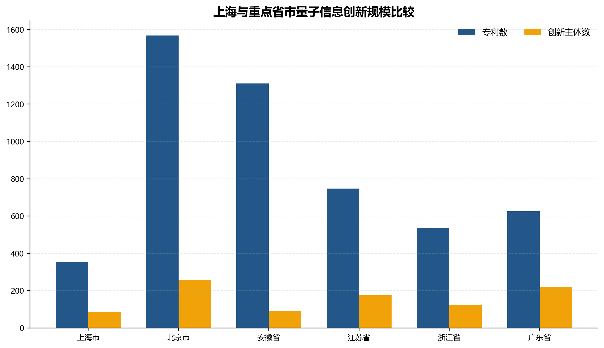
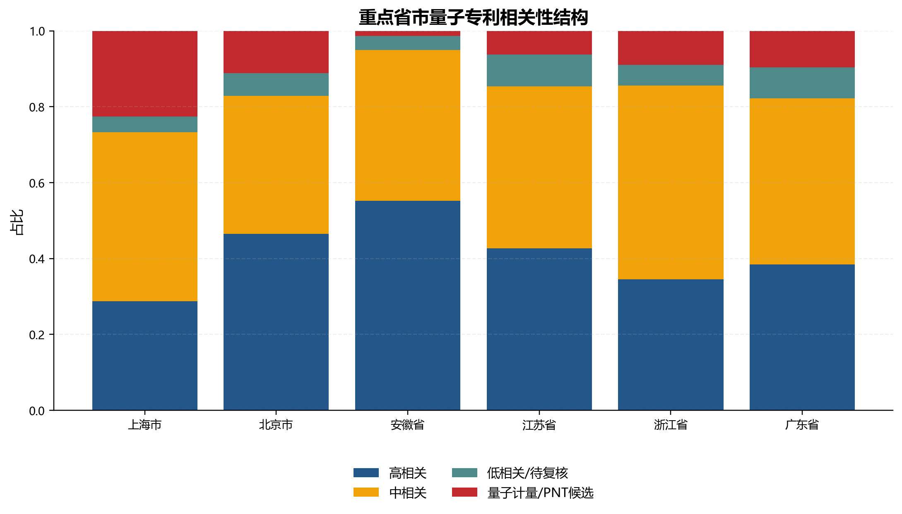
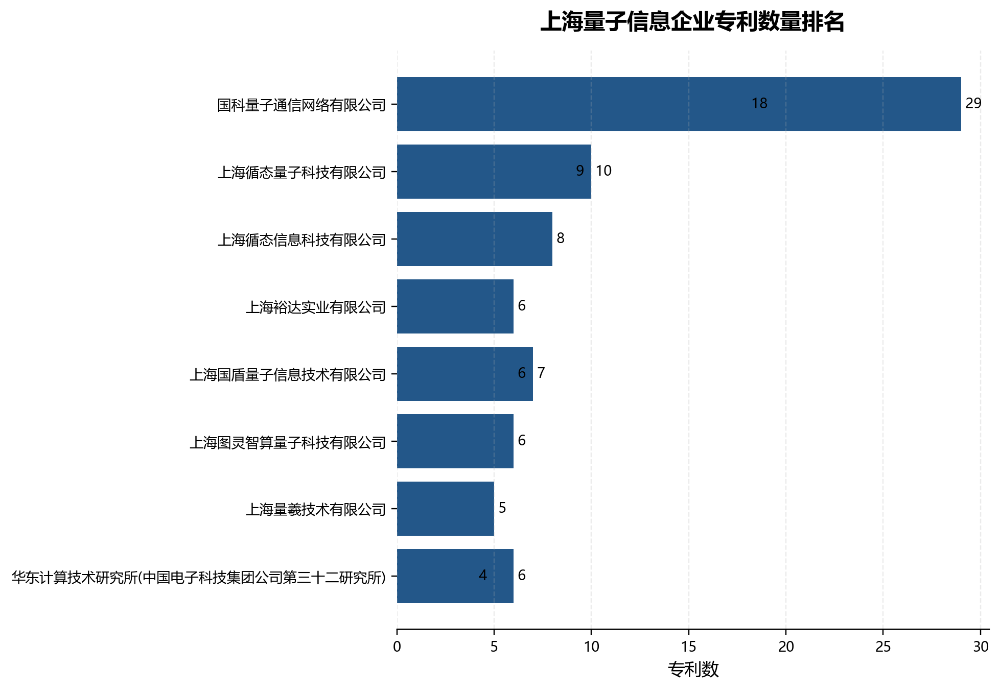
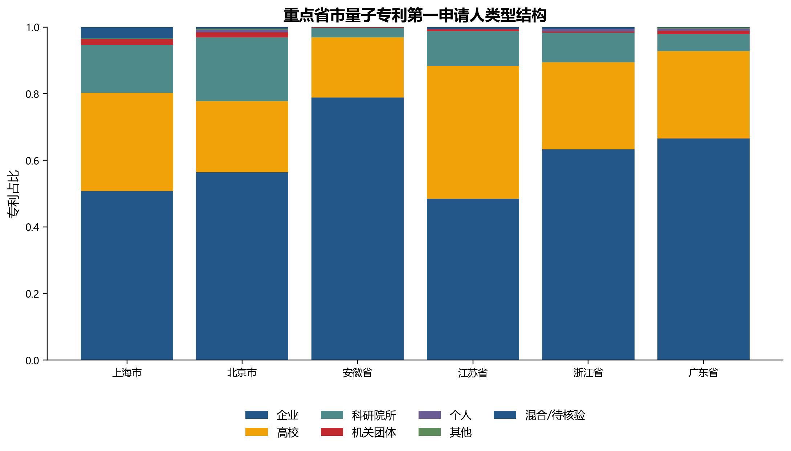
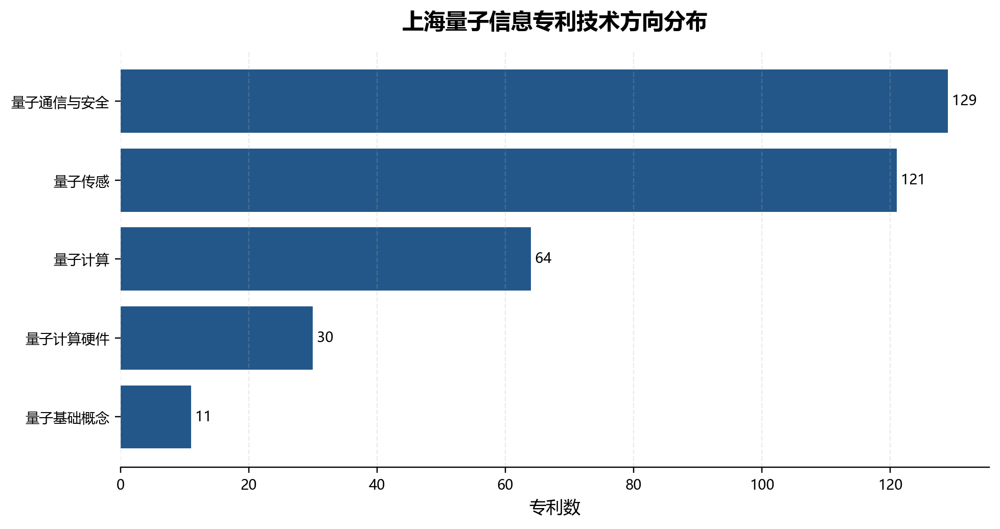
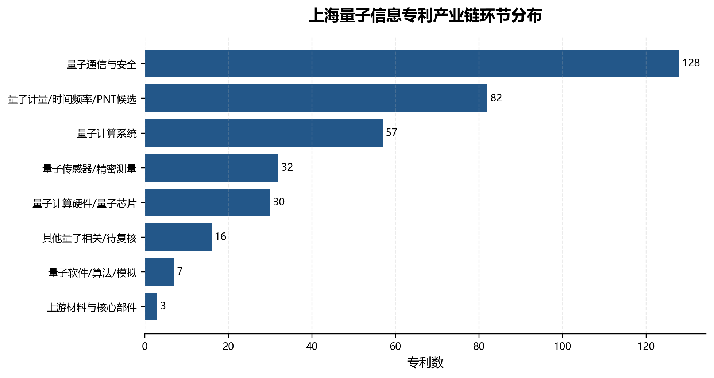
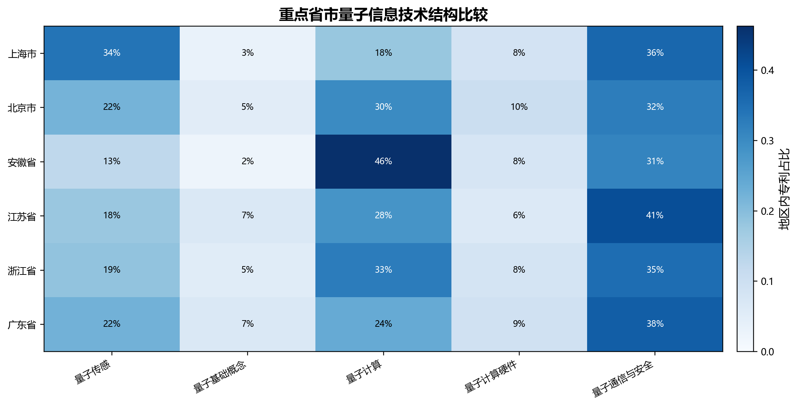

# 上海量子信息产业发展情况（咨询报告）

> **数据年份：** 2021年（单年截面）
> **数据来源：** 中国发明授权专利识别结果，共778条记录、271个第一申请人、覆盖27个省级地区
> **统计口径：** 第一申请人所在地（城市→省份映射）；企业统计采用"明确识别为企业"保守口径；严格核心专利 = 高相关 + 中相关；PNT候选 = 原子钟/时间频率/精密计量
> **核心约束：** 本报告仅反映2021年截面状态，所有"优势""不足""强""弱"判断均限定在专利创新口径内。专利数据不等于产业规模、营业收入、市场份额或产品落地。

## 核心发现

从2021年发明授权专利看，上海量子信息创新呈现 **"中等规模、多元主体、通信与传感双轮驱动、头部牵引不足"** 的基本格局。

**规模位势：** 上海量子相关专利65件，在全国27个有量子专利的省份中排第5位，介于安徽（66件）和广东（52件）之间，仅为北京（187件）的34.8%。24个创新主体排第5位，13家明确企业并列第3位。

**主体结构：** 上海的特点是"主体多、专利散"——有13家企业和8家高校院所参与量子创新，企业数量与江苏持平，但29件企业专利在重点省市中仅高于江苏（25件）。企业专利CR1仅27.6%，明显低于浙江（86.8%）、北京（54.7%）和安徽（50.0%），缺少单年专利规模突出的牵引型龙头。

**技术特征：** 量子传感（40.0%）和量子通信与安全（38.5%）构成两大支柱，合计占近八成。但量子传感高度依赖时间频率/PNT方向（26件中含18件PNT候选），严格核心的量子传感器仅5件。量子计算系统与硬件合计仅16.9%，软件算法和上游部件方向为零。

**企业画像：** 13家企业中9家仅1件专利，前两家（循态信息和国科量子通信）各8件且全为量子通信方向。与浙江如般量子（59件）、北京百度网讯（41件）、安徽本源量子（23件）的差距悬殊。

**科研储备：** 上海交通大学（13件）位列上海所有创新主体首位，覆盖五个技术方向。科研端技术储备多元，企业端高度集中于量子通信，两端存在技术结构错位。

以上发现均基于单年截面。正式报告需在多年数据基础上重新验证。

## 第一章 全国格局中的上海量子创新

### 一、全国量子科技发展总体态势

量子科技以量子计算、量子通信和量子精密测量为三大支柱，当前整体处于前沿技术驱动的孕育萌发与产业化初期阶段。[^1] 量子计算多种硬件路线并行推进，量子通信部分技术已进入工程化验证，量子精密测量在三大方向中商业化进程相对较快。[^2] 国家政策强调基础研究、关键核心技术、标志性产品和企业梯队的协同推进。[^3] 中国信通院2025年度报告表明，量子产业竞争已从单点科研拓展到核心器件、系统平台、软件生态和产业组织能力的多维度综合竞争。[^4]

从专利数据看，2021年全国共有27个省级地区识别出量子相关发明授权专利，但分布高度集中：仅北京（187件）一地的专利量就占全国的24.0%，前六省市（北京、浙江、江苏、安徽、上海、广东）合计537件，占全国的69.0%。这一格局表明，我国量子信息创新已形成以京津冀、长三角和粤港澳大湾区为核心的空间集聚态势。

### 二、上海在重点省市中的定位

上海量子相关专利65件，在六省市中排第5位，与安徽（66件）接近，高于广东（52件），但仅为北京的34.8%、浙江的69.1%。从多维指标看，六个省市可划分为三种类型：

**规模优势型——北京：** 187件专利、52个主体、19家企业、75件企业专利，四项指标均遥遥领先。技术分布均衡，量子通信（34.2%）、量子传感（29.9%）和量子计算（23.0%）三足鼎立。企业集中度中等（HHI=0.328），百度网讯以41件专利形成牵引。

**龙头牵引型——浙江和安徽：** 浙江94件专利高度集中于如般量子（59件，CR1=86.8%），量子计算占比53.2%。安徽66件专利集中于9个主体，本源量子和科大国盾分别贡献23件和13件，企业专利占比69.7%在六省市中第二。两者共同特征是"主体少、专利集中、龙头企业牵引力强"。

**多元分散型——江苏、广东和上海：** 江苏29个主体但企业专利占比最低（34.2%），量子通信方向集中（57.5%）。广东18家企业为六省市最多但专利最分散（HHI=0.121）。上海13家企业与江苏持平，24个主体居中，企业专利集中度（HHI=0.172）仅高于广东，技术结构偏向量子通信和传感/时间频率。

**表1  2021年六省市量子信息创新核心指标比较**

| 地区 | 专利数 | 主体数 | 企业数 | 企业专利数 | 企业专利占比 | 严格核心占比 | PNT候选数 | CR1 | HHI |
| ---- | -----: | -----: | -----: | ---------: | -----------: | -----------: | --------: | --: | ---: |
| 北京 |    187 |     52 |     19 |         75 |        40.1% |        79.7% |        30 | 54.7% | 0.328 |
| 浙江 |     94 |     18 |      8 |         68 |        72.3% |        89.4% |         7 | 86.8% | 0.756 |
| 江苏 |     73 |     29 |     13 |         25 |        34.2% |        82.2% |         4 | 40.0% | 0.197 |
| 安徽 |     66 |      9 |      5 |         46 |        69.7% |        93.9% |         3 | 50.0% | 0.361 |
| **上海** |  **65** |  **24** |  **13** |     **29** |    **44.6%** |    **67.7%** |    **18** | **27.6%** | **0.172** |
| 广东 |     52 |     29 |     18 |         32 |        61.5% |        86.5% |         4 | 28.1% | 0.121 |

**图1显示了专利数、主体数、企业数、严格核心专利数四个维度的对比**，北京的全面领先与上海的中游位置一目了然。

### 三、上海的时间频率/PNT特征在全国格局中的特殊性

上海严格核心专利占比67.7%，在六省市中最低，但PNT候选专利18件、占比27.7%，在六省市中最高。这一"一低一高"反映的不是核心能力不足，而是技术结构差异——上海大量专利来自原子钟、时间频率传递和精密计量方向，这些方向在关键词规则下被归入"广义量子相关"但严格核心匹配度较低。从全国数据看，陕西（38件专利中16件PNT候选，占42.1%）和湖北（35件中12件PNT候选，占34.3%）也呈现类似特征，上海的时间频率特色并非孤例，但叠加了更强的通信安全方向。

## 第二章 创新主体：企业基础好但缺龙头，高校储备多元但传导不足

### 一、13家企业的规模与分布

上海明确识别出13家量子相关企业、合计29件企业专利。企业专利数在上海全部65件中占44.6%，高于北京（40.1%）和江苏（34.2%），但低于浙江（72.3%）、安徽（69.7%）和广东（61.5%）。单从占比看，上海企业参与程度并不低；问题在于绝对规模——29件企业专利仅为北京的38.7%、浙江的42.6%、安徽的63.0%。

13家企业的专利分布呈典型的"长尾"结构：2家企业各8件（占企业专利的55.2%），2家企业各2件，9家企业各1件。9家单专利企业中，3家专利为纯PNT候选（众人网络安全、优扬新媒、示方科技），其主营业务可能与量子信息只有弱关联。单年数据无法区分"持续研发企业"、"新进入者"和"偶发主体"。

**表2  上海量子信息企业专利梯队（2021年）**

| 梯队 | 企业名称 | 专利数 | 严格核心 | 技术方向 | 识别得分 |
| ---- | -------- | -----: | -------: | -------- | -------: |
| 一档（8件） | 上海循态信息科技有限公司 | 8 | 8 | 量子通信与安全 | 9.25 |
| 一档（8件） | 国科量子通信网络有限公司 | 8 | 8 | 量子通信与安全 | 6.75 |
| 二档（2件） | 华东计算技术研究所 | 2 | 2 | 量子计算硬件 | 12.00 |
| 二档（2件） | 上海裕达实业有限公司 | 2 | 2 | 量子计算硬件 | 5.00 |
| 三档（1件） | 朗研光电 / 循态量子 / 国盾量子信息（通信）、银联商务（计算）、蔚来汽车 / 智车优行（传感）、众人网络安全 / 优扬新媒 / 示方科技（PNT） | 各1 | 7/9 | 分散 | 3.0—14.0 |

### 二、集中度比较揭示的结构性问题

上海企业专利CR1仅27.6%（前1家企业占企业专利总量的27.6%），CR3为62.1%，HHI为0.172。在六省市中仅高于广东（HHI=0.121），远低于浙江（0.756）和安徽（0.361）。集中度本身高低并无绝对优劣——浙江的高集中度意味着产业高度依赖单一企业，存在"单点风险"；上海的低集中度意味着生态更多元，但缺乏牵引龙头。

**表3  六省市企业专利集中度比较**

| 地区 | 企业数 | 企业专利数 | CR1 | CR3 | CR5 | HHI |
| ---- | -----: | ---------: | --: | --: | --: | ---: |
| 上海 |     13 |         29 | 27.6% | 62.1% | 72.4% | 0.172 |
| 北京 |     19 |         75 | 54.7% | 74.7% | 81.3% | 0.328 |
| 安徽 |      5 |         46 | 50.0% | 95.7% | 100.0% | 0.361 |
| 江苏 |     13 |         25 | 40.0% | 60.0% | 68.0% | 0.197 |
| 浙江 |      8 |         68 | 86.8% | 92.6% | 95.6% | 0.756 |
| 广东 |     18 |         32 | 28.1% | 50.0% | 59.4% | 0.121 |

上海的症结不在于集中度偏低本身，而在于"分散且小"——既没有形成浙江那样的超级龙头，也没有像广东那样依托18家企业形成规模总量。13家企业中位数专利仅为1件，说明多数企业尚未形成持续的量子研发产出。

### 三、高校院所：技术储备多元，但企业端尚未形成对应承接

上海8家高校院所合计33件专利，占全市量子相关专利的50.8%。上海交通大学以13件位居全市所有创新主体之首，覆盖全部五个技术方向。华东师范大学（6件）聚焦量子传感和计算硬件，复旦大学（2件）涉及量子计算硬件和量子传感。中科院上海光学精密机械研究所和微小卫星创新研究院分别拥有4件专利，但全部或大部分为PNT候选，代表了上海在时间频率和空间量子精密测量方向的特色科研力量。

**表4  上海主要高校院所量子专利情况**

| 主体 | 类型 | 专利数 | 严格核心 | PNT候选 | 主要方向 | 被引覆盖率 |
| ---- | ---- | -----: | -------: | ------: | -------- | ---------: |
| 上海交通大学 | 高校 | 13 | 7 | 5 | 传感（覆盖通信、计算、硬件、基础） | 23.1% |
| 华东师范大学 | 高校 | 6 | 5 | 0 | 传感、计算硬件 | 0% |
| 中科院微小卫星创新研究院 | 院所 | 4 | 1 | 3 | 传感、通信 | 0% |
| 中科院上海光机所 | 院所 | 4 | 0 | 4 | 传感（时间频率） | 0% |
| 东华大学 | 高校 | 2 | 2 | 0 | 通信与安全 | 0% |
| 复旦大学 | 高校 | 2 | 2 | 0 | 计算硬件、传感 | 50.0% |

科研端与企业端之间存在明显的技术结构错位：企业专利65.5%集中在量子通信（19件/29件），而高校院所在量子传感（含时间频率）有23件、量子计算硬件有6件、量子基础概念有3件——这些方向上企业仅有零星布局。这一错位意味着上海的科研多元性尚未转化为企业技术多样性。当然，单年专利数据无法判断是否已存在合作研发、专利转让或许可关系，正式报告需补充技术转移和产学研合作数据。

## 第三章 技术布局：通信与传感双轮驱动，计算链条薄弱

### 一、技术方向：量子传感和量子通信各占四成

上海65件量子相关专利中，量子传感26件（40.0%）、量子通信与安全25件（38.5%）、量子计算硬件6件（9.2%）、量子计算5件（7.7%）、量子基础概念3件（4.6%）。其中量子传感类的26件专利中，18件为PNT候选（原子钟、时间频率、精密计量），严格核心的量子传感器/精密测量仅5件。这意味着在剥离PNT后，量子通信与安全是上海企业化程度最高的核心量子技术方向。

量子通信方向的特点是"企业驱动"：5家明确企业贡献了25件中的19件（76.0%），是全市企业布局最集中的赛道。量子计算硬件方向的特点是"小而有质量"：6件专利全部为严格核心，华东计算技术研究所（识别得分12.0）和上海裕达实业为代表。量子计算系统方向的特点是"企业尝试"：银联商务作为非传统量子企业进入了量子计算应用层面。

**表5  上海量子信息技术方向分布**

| 技术方向 | 专利数 | 占比 | 主体数 | 企业数 | 企业专利 | 严格核心 | 识别得分 |
| -------- | -----: | --: | -----: | -----: | -------: | -------: | -------: |
| 量子传感 | 26 | 40.0% | 14 | 5 | 5 | 8（含PNT） | 4.35 |
| 量子通信与安全 | 25 | 38.5% | 8 | 5 | 19 | 25 | 7.64 |
| 量子计算硬件 | 6 | 9.2% | 5 | 2 | 3 | 6 | 8.00 |
| 量子计算 | 5 | 7.7% | 3 | 2 | 2 | 5 | 9.00 |
| 量子基础概念 | 3 | 4.6% | 3 | 0 | 0 | 0 | 4.00 |

### 二、产业链环节：通信安全最大，时间频率特色突出，四个环节空白

从技术/链条位置看，上海虽有7个环节的专利分布，但实际有效布局集中在3个环节。量子通信与安全25件（38.5%）为最大板块，面向通信设备、网络安全和系统集成。量子计量/时间频率/PNT候选19件（29.2%）为第二大板块，代表了精密测量和授时领域的特色积累。其他环节的体量均不足10件。

需要审慎对待四个"零专利"环节——上游材料与核心部件、量子软件/算法/模拟在当前样本中未见专利。这不等于上海在这些环节毫无基础：量子算法创新可能以论文和软件著作权形式存在，上游超导薄膜、光电器件等可能分散在非量子标签的专利中。但这些空白确实提示上海在量子计算软件栈、量子纠错编译和核心器件自主化方面尚未形成可识别的专利产出，需要进一步摸底。

**表6  上海量子信息专利技术/链条位置分布**

| 技术/链条位置 | 专利数 | 占比 | 主体数 | 企业数 | 企业专利 | 严格核心 |
| ------------ | -----: | --: | -----: | -----: | -------: | -------: |
| 量子通信与安全 | 25 | 38.5% | 8 | 5 | 19 | 25 |
| 量子计量/时间频率/PNT候选 | 19 | 29.2% | 10 | 3 | 3 | 1 |
| 量子计算硬件/量子芯片 | 6 | 9.2% | 5 | 2 | 3 | 6 |
| 量子传感器/精密测量 | 5 | 7.7% | 5 | 2 | 2 | 5 |
| 量子计算系统 | 5 | 7.7% | 3 | 2 | 2 | 5 |
| 其他/待复核 | 5 | 7.7% | 3 | 0 | 0 | 2 |
| 量子软件/算法/模拟 | 0 | 0% | — | — | — | — |
| 上游材料与核心部件 | 0 | 0% | — | — | — | — |

### 三、六省市对比：上海的"测量＋通信" vs 外地的"计算＋通信"

六省市的技术方向结构差异显著（表7）。上海量子计算（含系统+硬件）合计仅16.9%，远低于浙江的59.6%、安徽的43.9%和北京的31.6%。上海的差异化特征在于：量子传感占比最高（40.0%，主要来自时间频率）、PNT环节占比最高（29.2%，是第二名北京的1.8倍）。浙江和安徽的技术集中度最高——浙江量子计算单方向占53.2%（如般量子驱动），安徽量子通信+计算合计占80.3%。北京的均衡性最好，五个方向均有两位数专利。

**表7  六省市技术方向占比比较**

| 地区 | 量子传感 | 量子通信 | 量子计算 | 量子计算硬件 | 基础概念 |
| ---- | -------: | -------: | ------: | ----------: | ------: |
| 上海 | 40.0% | 38.5% | 7.7% | 9.2% | 4.6% |
| 北京 | 29.9% | 34.2% | 23.0% | 8.6% | 4.3% |
| 安徽 | 10.6% | 43.9% | 36.4% | 7.6% | 1.5% |
| 江苏 | 16.4% | 57.5% | 11.0% | 4.1% | 11.0% |
| 浙江 | 9.6% | 27.7% | 53.2% | 6.4% | 3.2% |
| 广东 | 23.1% | 44.2% | 13.5% | 13.5% | 5.8% |

从产业链环节看，上海在量子计量/时间频率/PNT（29.2%）方面一骑绝尘，但在量子计算系统（7.7%）方面远逊于浙江（52.1%）、安徽（36.4%）和北京（21.9%）。在量子软件/算法/模拟环节，北京、安徽、浙江和广东均有个位数专利布局，上海为零。

**上海的比较优势**在于量子通信安全和精密测量/时间频率两个方向——前者有5家企业19件专利支撑，后者有独特的科研和产业资源积累。**上海的明显短板**在于量子计算——无论是系统整机、硬件芯片、软件算法还是关键部件，均未形成规模化专利产出。

## 第四章 企业案例：差距在规模，特色在通信

### 一、上海三家代表性候选企业

以下均为依据2021年专利数据选出的候选，不等同于政府认定的龙头企业。

**上海循态信息科技有限公司（8件）**：8件专利全为严格核心量子通信方向，识别得分9.25，是上海量子识别相关性最高的企业。技术方向高度聚焦，专利内容集中于量子通信设备和系统。但其单年8件专利与外地头部企业存在数量级差距，后续需核验其产品体系、客户和应用案例。

**国科量子通信网络有限公司（8件）**：8件严格核心专利，全部集中于量子通信。从企业名称推断其可能涉及量子通信网络基础设施建设和运营，但被引覆盖率为零，识别得分（6.75）在头部企业中偏低。后续需核验其网络平台的实际部署规模、在网设备和运营状况。

**华东计算技术研究所（2件）**：仅2件专利，但技术方向为上海最薄弱的量子计算硬件和系统，识别得分12.0为全市最高。其主体属性介于科研院所和企业之间，正式企业名录应以其法人性质为准进一步确认。

### 二、外地代表性企业与上海的比较

**表8  六省市代表性企业专利画像**

| 企业 | 地区 | 专利数 | 严格核心 | 技术方向 | 环节覆盖 | 识别得分 |
| ---- | ---- | -----: | -------: | -------- | -------- | -------: |
| 上海循态信息科技 | 上海 | 8 | 8 | 通信 | 1个 | 9.25 |
| 国科量子通信 | 上海 | 8 | 8 | 通信 | 1个 | 6.75 |
| 华东计算所 | 上海 | 2 | 2 | 计算硬件 | 2个 | 12.00 |
| 如般量子科技 | 浙江 | 59 | 59 | 计算 | 2个 | 6.27 |
| 北京百度网讯 | 北京 | 41 | 41 | 计算 | 5个 | 14.29 |
| 合肥本源量子 | 安徽 | 23 | 23 | 计算 | 3个 | 10.78 |
| 科大国盾量子 | 安徽 | 13 | 13 | 通信 | 1个 | 6.54 |
| 国开启科量子（北京） | 北京 | 11 | 11 | 通信 | 1个 | 6.73 |

从比较中可提炼四个判断：

**专利规模差距悬殊。** 上海最大企业8件 vs 如般量子59件、百度网讯41件、本源量子23件，差距为2.9—7.4倍。即使考虑单年波动，也难以回避上海头部企业规模不足的判断。

**技术覆盖宽度不同。** 百度网讯覆盖5个环节（硬件→系统→软件→传感→通信），本源量子覆盖3个环节（硬件→系统→软件），上海代表性企业集中在1—2个环节。这说明外地头部企业更接近"平台型"或"系统型"，而上海头部企业更接近"细分专业型"。

**专业化方向截然不同。** 上海头部企业集中于量子通信，外地头部企业集中于量子计算。这一差异既是上海的特色定位（通信安全领域的企业集中度在全国位居前列），也是潜在的结构性风险（量子计算赛道的缺席可能影响长期战略位势）。

**科大国盾（13件）和国开启科（11件）同为量子通信企业**，与上海循态和国科量子处于同一赛道，但前两者专利规模也高于上海企业。在量子通信这一上海的优势赛道上，安徽和北京的头部企业同样形成了更大的专利积累。

## 第五章 问题诊断与政策建议

### 一、需要关注的五个结构性问题

**问题一：企业参与面广但深度不足，多数主体处于创新初期。** 13家企业中9家仅有1件专利，中位数仅为1件。在单年数据下，这些企业更像是"试水者"或"偶发参与者"，而非已经确立量子研发主线的持续创新力量。政策上需要区分"真正从事量子研发的企业"和"有量子相关专利的企业"。

**问题二：缺少专利规模显著的牵引型龙头企业。** 上海CR1仅27.6%，头部企业各8件。与如般量子（59件）或百度网讯（41件）这样的"超级主体"相比，上海在量子信息领域尚未出现具有全国辨识度的企业品牌。这一问题的影响不仅在于专利本身，更在于缺少能够组织产业链、建设开放平台和吸引上下游配套的牵引者。

**问题三：技术结构两极化——通信安全偏重、计算链条偏弱。** 上海78.5%的专利集中在量子传感和量子通信两大方向，量子计算相关专利合计仅16.9%，软件算法和上游部件为零。虽然时间频率和精密测量是上海的差异化优势，但量子计算作为最受关注的战略方向，上海在该赛道的参与度偏低。

**问题四：科研-企业之间存在技术方向错位。** 高校院所在传感（时间频率）、计算硬件和基础研究方面储备较广，企业端高度集中于通信方向。在当前专利数据中，看不到这种错位正在被有效衔接的迹象，也看不到科研端的技术储备正在通过创业孵化或技术转移形成新企业。

**问题五：PNT候选占比高，企业在精密测量方向参与不足。** 上海18件PNT候选专利中，来自企业的仅3件；严格核心的量子传感专利仅5件来自企业。时间频率方向更多是科研机构而非企业在推动，这意味着上海在精密测量和授时方向的特色优势，目前仍停留在科研端。

### 二、政策建议

**建议一：建立基于多年动态数据的企业分层识别体系。**

以多年专利数据（专利申请和授权的连续性）、主营业务核查和产品研发进展为三重依据，将上海量子相关主体区分为：核心量子企业（连续多年有严格核心专利、量子为主营业务）、关联量子企业（有量子专利但非主营业务、或仅有PNT候选专利）、科研主导主体和非持续主体四类。对仅1件专利或纯PNT候选的主体，不宜直接纳入量子信息企业名录或列为政策支持对象。年度更新企业图谱。

**建议二：在巩固通信和测量特色的前提下，实施量子计算"补链"行动。**

将有限的量子计算领域资源集中投放到上海已有初步基础的环节——超导/光量子芯片（依托上海交通大学、复旦大学）、量子计算测控系统（依托华东计算技术研究所和相关企业）、量子计算云平台接入。不宜追求全线铺开，而应选择1—2个有科研和产业基础的细分环节做深做透。同时，对软件算法和上游部件方向应先开展系统摸底，确认实际技术储备后再决定是否布局。

**建议三：以"科研-中试-企业"三级转化链替代单纯的专利数量考核。**

上海最大的结构性优势在于拥有上海交通大学、华东师范大学、复旦大学和多家在沪中科院机构构成的多元科研底座。当前的核心问题不是科研产出不足，而是科研成果向企业的传导不畅。建议聚焦量子通信器件、量子计算测控和量子传感仪器三个方向建设中试和测试平台，建立从科研专利到样机、产品、企业的全流程跟踪和激励机制。

**建议四：实施双轨制企业培育策略。**

第一轨——培育1—2家具有系统集成能力的平台型量子企业，承担技术整合、应用场景开拓和上下游带动功能。重点候选方向包括：量子通信网络运营与安全服务、量子计算云平台接入与行业应用。第二轨——在单光子器件、量子随机数芯片、光电控制模块、精密光学加工和信息安全解决方案等细分环节，支持一批"小而专"的专精特新企业。

**建议五：将PNT/时间频率纳入上海量子科技战略框架的特色支柱。**

上海在量子计量、时间频率和PNT方向的18件专利（全国居前）代表了独特的战略资源，叠加上海光机所、微小卫星创新研究院的科研积累和上海在航空航天、卫星导航、金融授时等应用场景方面的产业优势，完全有条件将精密测量/时间频率打造为区别于其他省市的特色量子科技板块。建议在国家时间频率体系、空间量子实验和下一代卫星导航增强系统等国家任务中积极争取上海角色。

**建议六：建设多维产业监测和评估体系。**

专利数据能够捕捉技术创新布局，但不能反映产业全貌。建议以年度更新的专利数据为基础底盘，逐步叠加企业工商和经营数据、重大项目和平台信息、投融资和人才流动数据、产品认证和应用案例等维度，形成年度更新的"上海量子信息技术产业图谱"，作为政策制定和资源配置的依据。

## 数据口径与局限

1. **年份限制：** 仅覆盖2021年单年数据，不可做增长率、趋势、持续创新和新进入分析。正式多年数据应重新运行全部分析。
2. **授权滞后：** 发明授权专利与实际研发和申请存在1—4年时间差。
3. **类型识别：** 约4.5%的主体类型字段为混合值，需人工复核。企业口径为"明确识别为企业"的保守估计。
4. **地区映射：** 省际比较依赖城市→省份映射，当前无未映射城市。原始`第一申请人地区`均为"中国"。
5. **被引字段：** 覆盖率仅5.5%，不可作为专利质量依据。
6. **量子识别得分：** 仅为关键词文本匹配得分，不反映专利质量、技术先进性或商业价值。
7. **PNT候选分类：** 包括原子钟、时间频率和精密计量，与严格核心量子专利在技术属性上有实质差异。
8. **专利≠产业：** 专利可反映技术布局和主体结构，不能直接代表营收、融资、市场份额、产品落地和产业竞争力。
9. **潜在重复：** 24条基础键存在潜在重复，正式数据需人工核验去重。

## 参考资料

[^1]: 工业和信息化部办公厅：《关于组织开展2025年未来产业创新任务揭榜挂帅工作的通知》，2025年1月。

[^2]: 中国信息通信研究院：《量子计算发展态势研究报告（2025年）》，2025年9月。

[^3]: 工业和信息化部等七部门：《关于推动未来产业创新发展的实施意见》，工信部联科〔2024〕12号。

[^4]: 中国信息通信研究院：《量子信息技术发展与应用研究报告（2025年）》，2025年12月。
